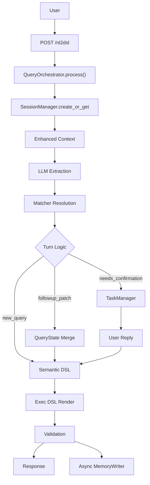
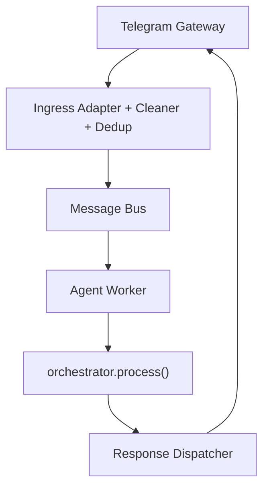
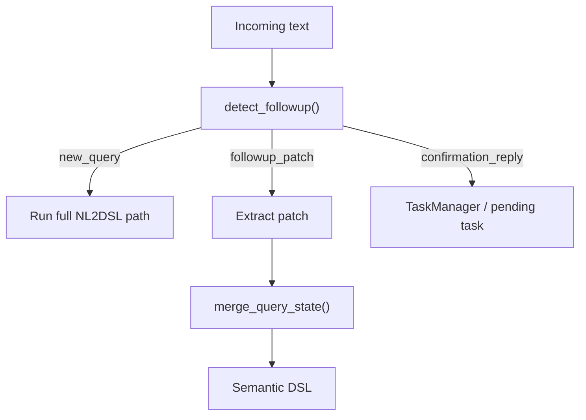
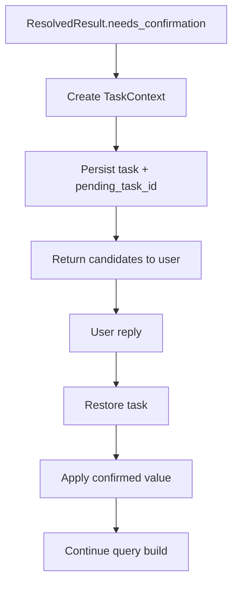

# Architecture Overview

[English](ARCHITECTURE.md) | [简体中文](ARCHITECTURE.zh-CN.md)

This document summarizes the current architecture of `query-agent`, the responsibility of each major module, and the intended dependency direction between layers.

## Layered View

```text
┌──────────────────────────────────────────────────────────────┐
│                      Gateway Layer                          │
│   TelegramGateway · HTTP Client / FastAPI Entry            │
├──────────────────────────────────────────────────────────────┤
│                        API Layer                            │
│   app.py                                                    │
│   endpoint defs · global service wiring · delegates to       │
│   QueryOrchestrator                                         │
├──────────────────────────────────────────────────────────────┤
│                     Turn / State Layer                      │
│   session_manager.py · session_models.py                    │
│   task_manager.py · followup_resolver.py                    │
│   query_state_merger.py                                     │
├──────────────────────────────────────────────────────────────┤
│                     NL2DSL Pipeline                         │
│   llm_extractions.py                                        │
│   matcher_service.py + matchers                             │
│   semantic_models.py · renderer.py · validators.py          │
├──────────────────────────────────────────────────────────────┤
│                     Memory Layer                            │
│   long_term_memory.py · memory_writer.py                    │
│   user_preference_store.py                                  │
├──────────────────────────────────────────────────────────────┤
│                  Runtime / System Layer                     │
│   bus/* · worker/* · dispatcher/* · server.py               │
└──────────────────────────────────────────────────────────────┘
```

## Dependency Direction

Core rule: dependencies flow downward.

```text
server.py
  ├─ gateway/*
  ├─ bus/*
  ├─ worker/*
  ├─ dispatcher/*
  └─ app.py
       └─ service/query_orchestrator.py
            ├─ service/session_manager.py
            ├─ service/task_manager.py
            ├─ service/followup_resolver.py
            ├─ service/query_state_merger.py
            ├─ service/llm_extractions.py
            ├─ matcher/*
            ├─ dsl/*
            └─ memory/*
```

Guidelines:

- `app.py` owns endpoint definitions and global wiring; business logic delegates to `QueryOrchestrator`.
- `server.py` owns startup wiring and lifecycle, not query semantics.
- `matcher/*` should stay focused on matching/retrieval, not session policy.
- `memory/*` should provide reusable signal/knowledge layers, not FastAPI behavior.

## Top-Level Runtime

### HTTP Path



### Telegram / Bus Path



## NL2DSL Pipeline

### Layer 1: LLM Extraction

Owned by [service/llm_extractions.py](service/llm_extractions.py).

Responsibilities:

- turn user text into structured extraction objects
- inject session context and selected project memory
- use follow-up-aware prompt wording to avoid rebuilding full state when patching

Input:

- `text`
- recent session context
- `last_query_state`
- selected `memory_corrections`

Output:

- `ExtractionsJson`

### Layer 2: Matcher Resolution

Owned by [matcher/matcher_service.py](matcher/matcher_service.py) and concrete matchers.

Responsibilities:

- resolve `metric / event / dimension / time`
- return score, candidates, and `needs_confirmation`
- keep resolution deterministic and inspectable

Important detail:

- user preference is applied **after recall** as a small rerank signal
- matcher itself remains the main semantic resolver

### Layer 3: Semantic DSL

Owned by [dsl/semantic_models.py](dsl/semantic_models.py).

Responsibilities:

- express canonical query intent
- separate query semantics from downstream execution format

### Layer 4: Exec DSL

Owned by [dsl/renderer.py](dsl/renderer.py) and [dsl/validators.py](dsl/validators.py).

Responsibilities:

- render executable payload
- validate region and consistency constraints

## Turn-Based Querying

Turn-based behavior is a first-class part of the architecture, not a prompt trick.

### Core Building Blocks

- [service/session_models.py](service/session_models.py)
  - `QueryState`
  - `SessionContext`
  - `TaskContext`
- [service/followup_resolver.py](service/followup_resolver.py)
- [service/query_state_merger.py](service/query_state_merger.py)
- [service/task_manager.py](service/task_manager.py)

### Turn Modes

The system distinguishes:

- `new_query`
- `followup_patch`
- `confirmation`

### Follow-Up Flow



### Why This Matters

This supports queries like:

```text
Q1: 德国 app_launch 的 PV
Q2: 昨天
Q3: 改成 UV
Q4: 再按渠道拆一下
Q5: 那美国呢
```

without forcing the user to restate all fields on every turn.

## Memory Architecture

The project now effectively has three memory layers.

### 1. Session Memory

Owned by:

- [service/session_manager.py](service/session_manager.py)
- [service/session_models.py](service/session_models.py)

Stores:

- `last_query_state`
- `pending_task_id`
- recent messages
- turn metadata

Purpose:

- follow-up patching
- confirmation continuation
- session restart recovery

### 2. Project Memory

Owned by [memory/long_term_memory.py](memory/long_term_memory.py).

Stores:

- project-specific corrections
- business constraints
- default mappings
- domain caveats

Important detail:

- memory is loaded from `project_{id}/MEMORY.md`
- current query text is used to select more relevant memory snippets
- the system no longer needs to inject every project memory fragment on every turn

### 3. User Preference Signal

Owned by [memory/user_preference_store.py](memory/user_preference_store.py).

Stores:

- user-scoped `event / metric / group_by` usage counts
- scoped by `project_id + user_id`

Purpose:

- rerank top candidates after recall
- never replace matcher semantics
- keep preference as a weak signal, not a primary resolver

## Confirmation Flow

Low-confidence ambiguity is handled by explicit confirmation, not silent guessing.

### Confirmation Lifecycle



### Persistence

Session state and task state are persisted separately:

- session: JSONL append-only session log
- task: JSONL append-only task log
- JSONL compaction: auto-compress when exceeding 500 lines, keeping 100 most recent + latest state/meta

This allows:

- process restart recovery
- delayed confirmation in chat channels
- long-running deployments without unbounded disk growth

## Async Memory Learning

Owned by [memory/memory_writer.py](memory/memory_writer.py).

Responsibilities:

- asynchronously judge whether a successful query contains reusable knowledge
- append learned memory into project-scoped files
- maintain `MEMORY.md` index automatically

This is intentionally sidecar behavior:

- non-blocking
- failure-tolerant
- should not break the main query path

## System Components

### `app.py`

Responsibilities:

- request/response models
- global service instantiation (SessionManager, TaskManager, QueryOrchestrator)
- endpoint definitions (delegates to QueryOrchestrator)
- Telegram notification helper

### `server.py`

Responsibilities:

- application lifespan
- matcher service initialization
- bus / worker / dispatcher wiring
- Telegram gateway startup
- catalog scheduler startup
- session periodic cleanup (5 min interval, 60 min expiry)

### `gateway/*`, `ingress/*`, `bus/*`, `worker/*`, `dispatcher/*`

Responsibilities:

- channel adaptation
- message cleaning and dedup
- async request transport
- worker consumption
- response routing

These components let the agent run as more than a plain HTTP API.

## Validation and Debugging

The system exposes rich explain/debug information:

- `resolver_explain`
- `turn_explain`
- candidate scores
- follow-up decision signals
- patch fields
- confirmed fields
- timing for major layers

This is important because the project is closer to an agent than a one-shot translator.

## Evaluation Strategy

The project uses both regular tests and data-driven end-to-end evals.

### End-to-End Eval Harness

Owned by:

- [tests/evals/nl2dsl_cases.yaml](tests/evals/nl2dsl_cases.yaml)
- [tests/test_end_to_end_evals.py](tests/test_end_to_end_evals.py)

Current coverage includes:

- basic new query
- follow-up patch
- follow-up + confirmation
- project memory injection
- restart + confirmation recovery

This is intentionally closer to “golden cases” than isolated unit tests.

## Catalog and Metadata

The checked-in YAML catalog is mainly a demo/development artifact.

The intended production direction is:

- metadata fetched from HTTP source
- synced into local catalog
- matcher indexes rebuilt on refresh

This matters because real deployments may have:

- tens of thousands of events
- multiple dimensions/properties per event
- project-specific vocabularies and constraints
