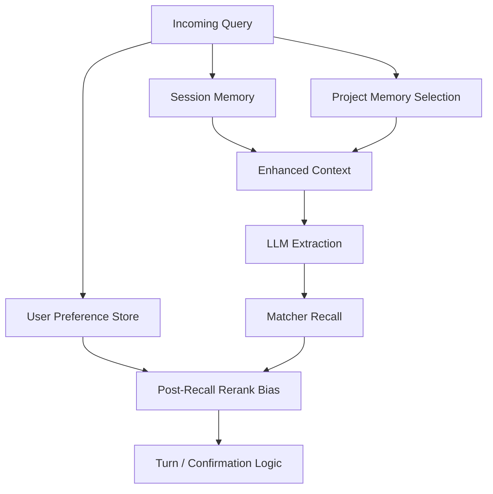

# Memory 架构

[English](MEMORY.md) | [简体中文](MEMORY.zh-CN.md)

本文说明 `query-agent` 里的 memory 设计：为什么这个项目不能只把“memory”看成聊天历史、为什么至少要分成 3 类，以及当前代码实现如何映射到这套模型。

## 为什么这里的 Memory 不是一回事

对数据查询 agent 来说，“memory” 不只是聊天记录。

不同来源的知识有不同的：

- 作用域
- 生命周期
- 可信度
- 使用位置

如果把这些全混在一起，系统会变得更不可靠：

- 短期 turn state 可能跨 session 泄漏
- 某个用户的习惯会污染其他用户
- 项目级业务规则会被误当成用户偏好

所以这个项目不应该停留在：

- session memory
- user memory

更自然的拆法是：

- Session Memory
- Project Memory
- User Preference Signal

## 第一层：Session Memory

### 存什么

Session memory 存当前会话里的短期状态：

- `last_query_state`
- `pending_task_id`
- recent messages
- turn type metadata

### 在哪里

- [service/session_models.py](service/session_models.py)
- [service/session_manager.py](service/session_manager.py)
- [service/task_manager.py](service/task_manager.py)

### 为什么需要

它解决的是 turn-based 连续性：

```text
Q1: 德国 app_launch 的 PV
Q2: 昨天
Q3: 改成 UV
```

如果没有 session memory，系统每一轮都得重新推断全部字段。

### 特征

- 作用域：当前 session
- 生命周期：短
- 可信度：高
- 使用位置：turn 解析前和解析中

## 第二层：Project Memory

### 存什么

Project memory 存项目级业务知识：

- 默认 event mapping
- 业务约束
- 纠正规则
- dimension/property caveats
- 项目特有的解释规则

例子：

- “在 project_55 中，激活默认映射 activation_success”
- “这个项目里 country 应优先映射 profile.country”
- “某类查询默认排除 internal traffic”

### 在哪里

- [memory/long_term_memory.py](memory/long_term_memory.py)
- 运行时文件位于 `data/memory/project_{id}/`

### 为什么需要

这类知识：

- 不是临时 session 状态
- 也不是某个用户的个人习惯
- 但对查询正确性非常关键

在真实 metadata 很大的环境里，这层尤其重要，例如：

- 4 万级 event
- 每个 event 很多 property
- 自然语言表达高度重叠

这时正确性很大程度上依赖项目语义，而不只是字符串匹配。

### 当前实现细节

Project memory 从 `project_{id}/MEMORY.md` 加载。

当前实现还做了一层轻量相关片段选择：

- 使用当前 query text
- 可选结合 `last_query_state`
- 只挑几条更相关的 memory 片段
- 避免每轮都把整份 memory 全注入

### 特征

- 作用域：project
- 生命周期：长
- 可信度：高
- 使用位置：extraction 前的 context injection

## 第三层：User Preference Signal

### 存什么

User preference 存轻量的使用习惯，例如：

- 常用 event
- 常用 metric
- 常用 group-by dimension

例子：

- user A 经常查 `payment_submit`
- user A 通常偏好 `uv`
- user A 经常按 `channel` 分组

### 在哪里

- [memory/user_preference_store.py](memory/user_preference_store.py)
- 运行时文件位于 `data/user_preferences/`

### 为什么需要

当多个候选都“看起来说得通”时，偏好信号可以帮助排序。

但它和项目业务语义不是一回事。

### 一个非常重要的限制

当前实现里，用户偏好被明确限制为：

- recall 之后的 rerank 信号

而不是：

- 主解析器
- 硬覆盖规则

也就是说：

1. matcher 仍负责主要语义召回
2. preference 只轻微影响 top candidates 排序
3. 作用域严格限定为 `project_id + user_id`

这样可以避免对用户历史过拟合。

### 特征

- 作用域：project + user
- 生命周期：中到长
- 可信度：中
- 使用位置：recall 后、最终选择前

## 为什么 User Preference 不能替代 Matching

看一个例子：

```text
用户历史：经常查 payment_success
当前 query：看注册完成
```

如果 preference 权重过强，系统可能会被带向支付类 event。  
所以用户偏好必须保持为弱信号。

好的用法：

- rerank top-k candidates

不好的用法：

- 在 recall 前做全局偏置
- 覆盖一个明显更强的语义匹配

## 为什么 Project Memory 和 User Preference 不一样

看这条规则：

```text
在 project_55 中，“激活”默认指 activation_success
```

这不是：

- 临时 session 信息
- 某个用户的私人习惯

它对任何查询这个项目的人都成立。  
所以它应该属于 project memory，不属于 user preference。

这也是为什么这个项目至少要分 3 类 memory，而不是 2 类。

## 当前优先级

当前项目里更合理的优先级是：

```text
explicit user input
  > session state
  > project memory
  > user preference rerank
```

含义是：

- 显式用户输入最强
- session state 用来补全省略字段
- project memory 约束解释空间
- user preference 只轻微影响排序

## 当前运行链路



## 已实现的部分

当前已经实现：

- session persistence and recovery
- `last_query_state`
- `pending_task_id`
- 从 `MEMORY.md` 加载 project memory
- project memory 相关片段选择
- user preference usage counts
- 按 `project_id + user_id` 作用域做 preference rerank

还没有完全实现：

- 更丰富的 `UserAlias`
- 更丰富的 `UserPattern`
- 按 category 做 memory retrieval（如 `constraint > correction > preference`）
- 超过简单计数的跨 session user memory

## 为什么短期 QueryState 不需要 AI 摘要

短期 query state 已经是结构化的。

例如：

```json
{
  "event": "app_launch",
  "metric": "pv",
  "time_range": {"type": "last_n_days", "n": 7},
  "region_filter": ["ROW"],
  "group_by": ["country"]
}
```

它已经比文本摘要更精确。  
所以对 session memory 来说，AI 摘要通常没有必要。

## 但为什么长期知识选择以后仍可能需要 AI

长期 memory 不一样，它会越来越多：

- 项目规则
- 纠正规则
- 学到的偏好
- caveats

当这些越来越多时，系统以后可能需要更智能的选择，用于：

- memory snippet choice
- few-shot example choice
- ambiguous explanation generation

所以“AI retrieval/summarization 不适用”只适用于短期结构化 turn state，不适用于 memory 的全部问题。

## 建议下一步

1. 加 category-aware 的 project memory retrieval
2. 把 `UserAlias` 和 `UserPattern` 从简单计数里拆开
3. 扩更多 project memory / user preference 的 eval case
4. 增加 project memory 和 user preference 冲突时的处理策略
