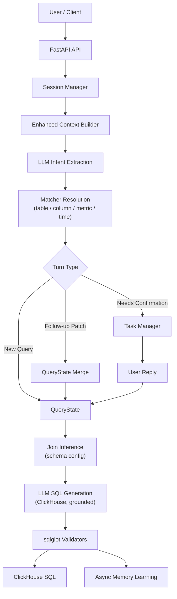

# Query Agent

[English](README.md) | [Chinese](docs/README.zh-CN.md)

Formatted documentation: [query-agent.mintlify.app](https://query-agent.mintlify.app/)

`query-agent` is a **NL2SQL Data Agent for ClickHouse**. It accepts natural language questions, extracts query intent fragments (`table / metric / column / filter / time / group_by / order / window`), resolves them to canonical schema entities with deterministic matchers, and generates validated ClickHouse SQL — with multi-turn sessions, confirmation flows for ambiguous entities, project memory, and user-preference reranking.

The project is not a plain text2sql demo. It is a controlled data agent with:

- HTTP and Telegram entry points
- turn-based follow-up and confirmation handling
- Session Memory, Project Memory, and User Preference signals
- Direct and Redis message bus modes
- data-driven end-to-end eval cases

## Overview

Core query flow:

```text
Natural Language
  -> LLM Intent Extraction (Layer 1)
  -> Deterministic Entity Resolution (Layer 2: table / column / metric / time)
  -> QueryState / Turn Logic
  -> LLM SQL Generation grounded on resolved entities (Layer 3)
  -> sqlglot Validation (read-only, table whitelist, auto LIMIT)
  -> ClickHouse SQL
```

Runtime flow:

```text
Gateway
  -> Ingress
  -> Message Bus
  -> Agent Worker
  -> NL2SQL Pipeline
  -> Dispatcher
```

## Highlights

- **Deterministic entity resolution**: table/column/metric names are resolved by IDF-weighted inverted-index recall (discriminative tokens dominate generic ones) with edit-distance typo probing, then RapidFuzz rerank against the schema catalog (scored, with candidates) — the LLM never invents entity names
- **Confirmation flow as guardrail**: low-confidence entities trigger explicit user confirmation instead of silent guessing — thresholds are calibrated per entity type (metrics are stricter: auto-accept at 90, since a wrong metric means wrong numbers), and a deterministic tie guard sends top candidates that are within 10 points of each other to confirmation even above the acceptance line; missing join paths escalate too
- **Schema-configured joins**: join relationships come from metadata, not LLM invention
- **Turn-based Q&A**: `last_query_state` + follow-up detection + field-level patch merge (a state machine, not chat replay)
- **Grounded SQL generation**: the generation prompt pins resolved table/column/metric names, join conditions, and time predicates; the LLM assembles query structure only
- **sqlglot validation**: single read-only statement, table whitelist, default LIMIT injection, and a repair loop with error feedback (max 2 rounds)
- Session persistence (JSONL append-only, restart recovery) and pending-task persistence (idempotent confirmation)
- Async memory learning: successful queries can write back correction/preference/constraint memory
- End-to-end eval suite for new queries, follow-ups, confirmations, memory injection, and restart recovery

## Example Session

```text
Q1: Revenue by region for the last 7 days
-> SELECT users.region AS region, sum(orders.amount) AS revenue
   FROM orders JOIN users ON orders.user_id = users.id
   WHERE orders.created_at >= now() - INTERVAL 7 DAY
   GROUP BY users.region ORDER BY revenue DESC LIMIT 100

Q2: only gold members, top 3 per region
-> patch: filters += [users.vip_level = 'gold'], window = {users.region, top 3}
-> SELECT users.region AS region, sum(orders.amount) AS revenue
   FROM orders JOIN users ON orders.user_id = users.id
   WHERE users.vip_level = 'gold' AND orders.created_at >= now() - INTERVAL 7 DAY
   GROUP BY users.region ORDER BY revenue DESC LIMIT 3 BY users.region
```

Q2 inherits metric / time / grouping from Q1 — only the deltas are extracted and merged. `LIMIT 3 BY` is ClickHouse's grouped-ranking syntax.

## Key Concepts

### 1. Layered Generation

- **Layer 1 (LLM extraction)** only splits the question into intent fragments — it never names tables or columns.
- **Layer 2 (matchers)** resolves fragments to canonical `table` / `table.column` / `metric_id` names with scores: auto-accept thresholds are calibrated per type (metric 90, table/column 80), scores in the confirmation band (40 up to the threshold) require user confirmation, and a top-1/top-2 margin under 10 points forces confirmation even above the threshold; < 40 drops or falls back. Recall is IDF-weighted (BM25-lite) with edit-distance-1 typo probing for zero-hit tokens. Same-alias collisions across entities (e.g. `amount` on two tables) are never silently first-wins: they resolve by join distance when a base table is known, or surface as confirmation. The main table is inferred when the user does not name one (from the metric's declared table or column ownership votes).
- **Layer 3 (SQL generation)** is an LLM call *grounded* on resolved entities. The prompt pins table names, column names, metric expressions, join conditions, and the time predicate; the LLM assembles structure (GROUP BY / JOIN / window ranking via `LIMIT n BY`).
- **Validation** (sqlglot, `dialect="clickhouse"`) enforces read-only single statements, a table whitelist, and default LIMIT; failed generations are repaired with error feedback.
- **AST post-analysis** (`service/sql_ast_analyzer.py`) then runs on the validated SQL: column-existence checks (with alias resolution via sqlglot qualify), entity-fidelity assertions (resolved tables / metric expressions / filter predicates must survive into the SQL — catching semantic drift), join-edge and join-key consistency against the declared `joins:` config, and static cost analysis (scan estimates from `est_rows`, full-scan-on-fact-table detection, join-chain depth). Analysis errors feed the same repair loop; warnings and cost metrics are reported in `explain.resolver_explain.sql_generation.ast_analysis`.
- **Cross-encoder reranking** (`service/reranker.py`, `RERANKER_ENABLED=true`) is a constrained LLM final selection step for ambiguous matches: when the matcher lands in the confirmation band — or top candidates are tied — the LLM rescores the existing candidates (it can only pick from them, never invent values). A clear winner (relevance ≥ 85 with margin ≥ 15) is silently accepted, turning a would-be confirmation interrupt into a direct answer; otherwise the confirmation flow proceeds with better-ordered candidates. Production can swap in a local cross-encoder model (e.g. bge-reranker-v2-m3) behind the same interface.

### 2. Turn-Based Querying

```text
Q1: Revenue by region for the last 7 days    (new query)
Q2: Yesterday                                (patch time_range)
Q3: Change to order count                    (patch metrics)
Q4: Break it down by category                (patch group_by)
Q5: What about the products table?           (patch tables)
Q6: Top 3 per region                         (patch window)
```

Turn detection is rule-based (`followup_resolver`), state merging is field-level (`query_state_merger` with explicit/inherited provenance), and every turn is explainable via `turn_explain`.

### 3. Memory Layers

- `Session Memory` — `last_query_state / pending_task / recent turns`, JSONL persisted and restart-recoverable
- `Project Memory` — project-scoped corrections/constraints (`project_{id}/MEMORY.md`), keyword-selected and injected into the extraction prompt
- `User Preference Signal` — per `project_id + user_id` usage counts of tables/metrics/columns, applied only as a weak post-recall rerank bias

## Quick Start

### Requirements

- Python 3.11+
- Redis only when `MESSAGE_BUS_BACKEND=redis`

### Install

```bash
pip install -r requirements.txt
```

### Configure

```bash
cp .env.example .env
```

Common environment variables:

| Variable | Required | Default | Description |
|---|---|---|---|
| `PORT` | No | `8000` | HTTP port |
| `HOST` | No | `0.0.0.0` | Bind address |
| `LOG_LEVEL` | No | `DEBUG` | Logging level |
| `LLM_BACKEND` | No | `zhipu` | `zhipu` or `ollama` |
| `ZHIPU_MODEL` | No | `glm-4` | Extraction + SQL generation model |
| `TOOL_CALLING_ENABLED` | No | `true` | `false` forces prompt-based JSON output |
| `RERANKER_ENABLED` | No | `false` | `true` enables LLM cross-encoder reranking for ambiguous matches |
| `TELEGRAM_BOT_TOKEN` | No | - | Telegram gateway token |
| `MESSAGE_BUS_BACKEND` | No | `direct` | `direct` or `redis` |
| `REDIS_URL` | No | `redis://localhost:6379/0` | Redis URL |

### Run

Local direct mode:

```bash
python server.py
```

Development mode:

```bash
uvicorn server:app_with_ws --reload --port 8000
```

Redis mode:

```bash
MESSAGE_BUS_BACKEND=redis docker-compose up --build
```

### Try it

```bash
curl -X POST localhost:8000/nl2sql -H 'Content-Type: application/json' -d '{
  "text": "Revenue by region for the last 7 days",
  "project_id": 55
}'
```

Response fields include:

- `extraction_json` — Layer 1 intent fragments
- `sql` — validated ClickHouse SQL
- `resolved_intent` — the full query state used for generation
- `explain` — `resolver_explain` / `turn_explain` / `sql_generation` / timing
- `session_id`, `status`, `message`, `task_id`, `candidates`

Status values:

- `status=success`: SQL was generated and validated
- `status=early_exit`: no usable query signal (no table/metric/filter mentioned)
- `status=needs_confirmation`: low-confidence candidates require user confirmation

`POST /nl2dsl` remains as a compatibility alias. Session debug APIs: `GET /sessions`, `GET /sessions/{id}`, `DELETE /sessions/{id}`.

## Architecture Summary



For a deeper module breakdown, see [ARCHITECTURE.md](docs/ARCHITECTURE.md).

## Project Layout

```text
query-agent/
├── app.py                     # FastAPI route (POST /nl2sql) + global wiring
├── server.py                  # lifecycle bootstrap + gateway/bus wiring
├── gateway/                   # Telegram gateway
├── ingress/                   # cleaning / dedup / adapter
├── bus/                       # direct / redis bus
├── worker/                    # agent worker
├── dispatcher/                # response dispatch
├── service/
│   ├── llm_extractions.py     # Layer 1: intent extraction (SQLIntentJson)
│   ├── sql_generator.py       # Layer 3: grounded SQL generation + repair loop + time exprs
│   ├── sql_validator.py       # sqlglot guardrails
│   ├── query_orchestrator.py  # three turn paths (new / followup / confirmation)
│   ├── session_manager.py     # session memory (JSONL persisted)
│   ├── session_models.py      # QueryState / TaskContext / SessionContext
│   ├── task_manager.py        # confirmation tasks (idempotent, persisted)
│   ├── followup_resolver.py   # rule-based turn detection
│   └── query_state_merger.py  # field-level patch merge
├── matcher/
│   ├── base.py                # IDF-weighted inverted index + typo probing + RapidFuzz (core)
│   ├── schema_loader.py       # sql_schema.yaml -> SQLSchema
│   ├── table_matcher.py       # table name resolution
│   ├── column_matcher.py      # column resolution (doc = "table.column")
│   ├── sql_metric_matcher.py  # business metric resolution
│   ├── time_matcher.py        # time range parsing
│   └── matcher_service.py     # unified resolution + table/join inference
├── memory/                    # project memory / memory writer / user preferences
├── catalog/sql_schema.yaml    # demo schema metadata (see Production Notes)
├── data/                      # session / task / memory / preference runtime data
└── tests/                     # unit + integration + data-driven e2e evals
```

## Schema Metadata & Production Notes

Table/column/metric metadata lives in [catalog/sql_schema.yaml](catalog/sql_schema.yaml) — a local demo sample (an `orders / users / products` e-commerce schema with declarative joins and metric expressions such as `revenue = sum(orders.amount)`).

This demo deliberately stops at **NL → validated ClickHouse SQL**. The following production extensions are documented as the intended direction and are not implemented here:

1. **Metadata sourcing** — `sql_schema.yaml` is the development/demo input. In production, table/column/metric metadata should be synced from the company metadata service (or `INFORMATION_SCHEMA`) on a schedule, then fed into `load_sql_schema()` to hot-rebuild matcher indexes.
2. **Query execution** — running the SQL against a real ClickHouse (read-only account, statement timeout, row/cost caps, result caching) is a downstream step; the current API returns SQL only.
3. **Result rendering** — chart/table rendering of query results belongs to the presentation layer.
4. **Governance hardening** — row-level security via user-scoped predicates, per-user rate limits, PII masking, and full audit logging are natural next steps on top of the existing validator.

## Evaluation

The project uses two kinds of tests:

- unit / integration tests
- data-driven end-to-end eval cases: [tests/evals/nl2sql_cases.yaml](tests/evals/nl2sql_cases.yaml) + [tests/test_end_to_end_evals.py](tests/test_end_to_end_evals.py)

Current coverage includes:

- basic new query (explicit table, and table inferred from a metric)
- follow-up patches (time / metric / window rank)
- follow-up + confirmation
- project memory injection
- confirmation after restart

The eval harness mocks LLM extraction and SQL generation but runs the real matcher service, threshold logic, state merging, confirmation flow, and persistence — golden cases pin down the deterministic core of the pipeline.

Run:

```bash
./.venv311/bin/pytest -q
```

## Docs Map

- [Formatted Docs](https://query-agent.mintlify.app/): hosted Mintlify documentation
- [docs/README.md](docs/README.md): documentation index
- [README.zh-CN.md](docs/README.zh-CN.md): Chinese readme
- [ARCHITECTURE.md](docs/ARCHITECTURE.md): current architecture, module ownership, and dependency direction
- [ARCHITECTURE.zh-CN.md](docs/ARCHITECTURE.zh-CN.md): Chinese architecture document
- [EVALUATION.md](docs/EVALUATION.md): eval harness, golden cases, and regression strategy
- [MEMORY.md](docs/MEMORY.md): session/project/user memory design
- [MEMORY.zh-CN.md](docs/MEMORY.zh-CN.md): Chinese memory design document
- [docs/diagrams/architecture.md](docs/diagrams/architecture.md): Mermaid architecture diagrams
- [docs/diagrams/sequence.md](docs/diagrams/sequence.md): sequence diagrams
- [docs/diagrams/flowchart.md](docs/diagrams/flowchart.md): high-level flowcharts
- [TELEGRAM_TEST.md](docs/TELEGRAM_TEST.md): Telegram testing notes

## Current Status

The main capabilities currently in place are:

- `NL -> validated ClickHouse SQL` pipeline (single table, joins from schema config, grouped ranking via `LIMIT n BY`)
- turn-based query handling with structured state merging
- confirmation flow with persisted, idempotent tasks
- session/task persistence and restart recovery
- project memory injection
- user preference rerank signal
- async memory learning
- end-to-end eval harness

Good next steps:

- richer `UserPattern / UserAlias / Preferences`
- metadata service sync for schema hot-reload
- query execution layer (read-only ClickHouse runner with cost guards)
- larger golden eval set based on real query logs
