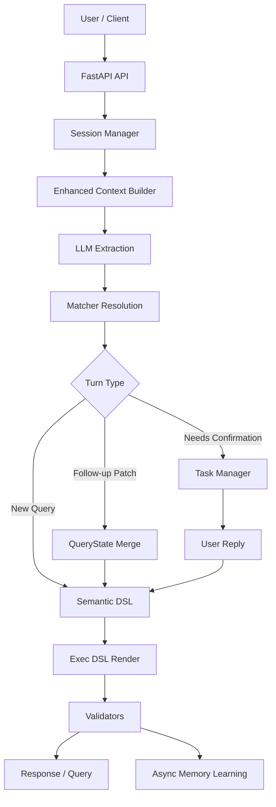

# Query Agent

[English](README.md) | [Chinese](docs/README.zh-CN.md)

`query-agent` is a data-query-oriented NL2DSL agent. It accepts natural language questions, extracts `event / metric / time / region / group_by`, builds a canonical semantic DSL, renders an executable DSL, and supports multi-turn sessions, confirmation flows, project memory, user preference reranking, and asynchronous memory learning.

The project is no longer a single-turn `NL -> DSL` demo. It is evolving into a controlled data agent with:

- HTTP and Telegram entry points
- turn-based follow-up and confirmation handling
- Session Memory, Project Memory, and User Preference signals
- Direct and Redis message bus modes
- project-level catalog synchronization
- data-driven end-to-end eval cases

## Overview

Core query flow:

```text
Natural Language
  -> LLM Extraction
  -> Matcher Resolution
  -> QueryState / Turn Logic
  -> Semantic DSL
  -> Exec DSL
  -> Validation
```

Runtime flow:

```text
Gateway
  -> Ingress
  -> Message Bus
  -> Agent Worker
  -> NL2DSL Pipeline
  -> Dispatcher
```

## Highlights

- Layered NL2DSL pipeline: extraction, matching, semantic DSL, exec DSL, validation
- Turn-based Q&A: `last_query_state`, follow-up detection, patch merge, confirmation flow
- Session persistence: JSONL append-only session storage with restart recovery
- Pending task persistence: confirmation tasks can survive process restarts
- Project-scoped memory: `project_{id}/MEMORY.md` with relevant-snippet selection
- User preference rerank: post-recall bias scoped by `project_id + user_id`
- Async memory learning: successful queries can write back correction, preference, and constraint memory
- Telegram long-polling gateway and message-bus-based worker orchestration
- End-to-end eval suite for new queries, follow-ups, confirmations, memory injection, and restart recovery

## Key Concepts

### 1. Semantic DSL vs Exec DSL

- `Semantic DSL` represents the normalized intent of a user query.
- `Exec DSL` is the executable payload sent to the downstream query system.

This split makes it easier to:

- explain why the agent resolved a query in a certain way
- confirm, patch, and validate intermediate state
- test behavior at the semantic layer before execution details

### 2. Turn-Based Querying

The system supports multi-turn querying, for example:

```text
Q1: Show PV for app_launch in Germany
Q2: Change it to yesterday
Q3: Break it down by channel
Q4: What about the US?
```

The agent does not rebuild the whole query from scratch on every turn. Instead:

- `last_query_state` carries the previous structured state
- `followup_resolver` decides whether the current turn is a new query or a follow-up
- `query_state_merger` applies field-level patches to the previous state

### 3. Memory Layers

The project currently uses three main memory layers:

- `Session Memory`
  - current-session `last_query_state / pending_task / recent turns`
- `Project Memory`
  - project-specific business constraints, default mappings, corrections, and caveats
- `User Preference Signal`
  - frequently used `event / metric / group_by` scoped by `project_id + user_id`

User preference is not a primary resolver. It is only used as a weak post-recall rerank signal.

## Quick Start

### Requirements

- Python 3.11+
- `pip`
- Redis only when `MESSAGE_BUS_BACKEND=redis`

### Install

```bash
pip install -r requirements.txt
```

### Configure

Copy and edit the environment file:

```bash
cp .env.example .env
```

Common environment variables:

| Variable | Required | Default | Description |
|---|---|---|---|
| `PORT` | No | `8000` | HTTP port |
| `HOST` | No | `0.0.0.0` | Bind address |
| `LOG_LEVEL` | No | `DEBUG` | Logging level |
| `TELEGRAM_BOT_TOKEN` | No | - | Telegram gateway token |
| `MESSAGE_BUS_BACKEND` | No | `direct` | `direct` or `redis` |
| `REDIS_URL` | No | `redis://localhost:6379/0` | Redis URL |
| `CATALOG_API_BASE` | No | - | Catalog sync source |

Configure LLM, downstream query, and Bearer-related variables according to your local environment.

### Run

Local direct mode:

```bash
python server.py
```

Development mode:

```bash
uvicorn server:app_with_ws --reload --port 8000
```

Redis mode:

```bash
MESSAGE_BUS_BACKEND=redis docker-compose up --build
```

## API

### `POST /nl2dsl`

Main natural-language-to-DSL endpoint.

Request example:

```json
{
  "text": "Show PV for app_launch in Germany over the last 7 days",
  "project_id": 55,
  "session_id": "optional-session-id",
  "user_id": "optional-user-id"
}
```

Response fields include:

- `extraction_json`
- `semantic`
- `exec_dsl`
- `explain`
- `session_id`
- `status`
- `message`
- `task_id`
- `candidates`

Status values:

- `status=success`: the query was resolved and DSL was generated
- `status=early_exit`: required information is missing, such as an event
- `status=needs_confirmation`: low-confidence candidates require user confirmation

### `POST /query/bearer`

Execute a downstream Bearer query.

### Session Debug APIs

- `GET /sessions`
- `GET /sessions/{session_id}`
- `DELETE /sessions/{session_id}`

## Architecture Summary



For a deeper module breakdown, see [ARCHITECTURE.md](docs/ARCHITECTURE.md).

## Project Layout

```text
query-agent/
├── app.py                     # FastAPI route + NL2DSL main flow
├── server.py                  # lifecycle bootstrap + gateway/bus wiring
├── gateway/                   # Telegram gateway
├── ingress/                   # cleaning / dedup / adapter
├── bus/                       # direct / redis bus
├── worker/                    # agent worker
├── dispatcher/                # response dispatch
├── service/
│   ├── llm_extractions.py
│   ├── session_manager.py
│   ├── session_models.py
│   ├── task_manager.py
│   ├── followup_resolver.py
│   └── query_state_merger.py
├── matcher/                   # metric / event / dimension / time matchers
├── dsl/                       # semantic models, renderer, validators
├── memory/
│   ├── long_term_memory.py
│   ├── memory_writer.py
│   └── user_preference_store.py
├── catalog/                   # demo YAML catalog
├── data/                      # session / task / memory / preference runtime data
└── tests/
```

## Catalog Note

The checked-in `catalog/*.yaml` files are mainly for demos and local development. In a realistic deployment, metadata is expected to come from:

- HTTP metadata services loaded at startup
- scheduled sync jobs that materialize metadata into the local catalog

In other words:

- `catalog YAML` is the development/demo input
- `metadata service + sync` is the production-oriented direction

## Evaluation

The project uses two kinds of tests:

- unit / integration tests
- data-driven end-to-end eval cases

The end-to-end eval suite lives in:

- [tests/evals/nl2dsl_cases.yaml](tests/evals/nl2dsl_cases.yaml)
- [tests/test_end_to_end_evals.py](tests/test_end_to_end_evals.py)

Current coverage includes:

- basic new query
- follow-up patch
- follow-up + confirmation
- project memory injection
- confirmation after restart

Run:

```bash
./.venv311/bin/pytest -q
```

## Docs Map

- [docs/README.md](docs/README.md): documentation index
- [ARCHITECTURE.md](docs/ARCHITECTURE.md): current architecture, module ownership, and dependency direction
- [ARCHITECTURE.zh-CN.md](docs/ARCHITECTURE.zh-CN.md): Chinese architecture document
- [EVALUATION.md](docs/EVALUATION.md): eval harness, golden cases, and regression strategy
- [EVALUATION.zh-CN.md](docs/EVALUATION.zh-CN.md): Chinese evaluation document
- [MEMORY.md](docs/MEMORY.md): session/project/user memory design
- [MEMORY.zh-CN.md](docs/MEMORY.zh-CN.md): Chinese memory design document
- [docs/diagrams/architecture.md](docs/diagrams/architecture.md): Mermaid architecture diagrams
- [docs/diagrams/architecture.zh-CN.md](docs/diagrams/architecture.zh-CN.md): Chinese Mermaid architecture diagrams
- [docs/diagrams/sequence.md](docs/diagrams/sequence.md): sequence diagrams
- [docs/diagrams/sequence.zh-CN.md](docs/diagrams/sequence.zh-CN.md): Chinese sequence diagrams
- [docs/diagrams/flowchart.md](docs/diagrams/flowchart.md): high-level flowcharts
- [docs/diagrams/flowchart.zh-CN.md](docs/diagrams/flowchart.zh-CN.md): Chinese high-level flowcharts
- [docs/diagrams/matcher-sequence.md](docs/diagrams/matcher-sequence.md): matcher sequence details
- [docs/diagrams/matcher-sequence.zh-CN.md](docs/diagrams/matcher-sequence.zh-CN.md): Chinese matcher sequence details
- [TELEGRAM_TEST.md](docs/TELEGRAM_TEST.md): Telegram testing notes
- [TELEGRAM_TEST.zh-CN.md](docs/TELEGRAM_TEST.zh-CN.md): Chinese Telegram testing notes

## Current Status

The main capabilities currently in place are:

- `NL -> DSL` pipeline
- turn-based query handling
- confirmation flow
- session/task persistence
- project memory injection
- user preference rerank signal
- async memory learning
- end-to-end eval harness

Good next steps:

- richer `UserPattern / UserAlias / Preferences`
- stronger memory categorization and retrieval
- larger golden eval set based on real query logs
