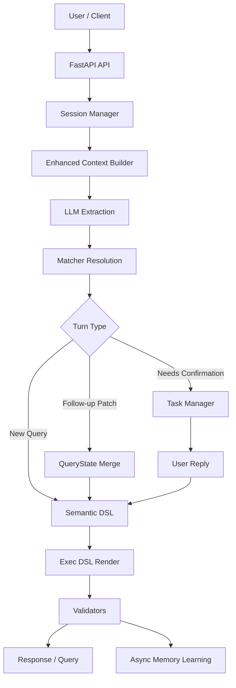

# Query Agent

[English](README.md) | [简体中文](README.zh-CN.md)

`query-agent` 是一个面向数据查询场景的 NL2DSL Agent。它接收自然语言问题，解析出 `event / metric / time / region / group_by`，构建语义 DSL，渲染为可执行 DSL，并支持多轮会话、确认流、项目记忆、用户偏好重排和异步记忆学习。

这个项目已经不只是一个单轮 `NL -> DSL` Demo，而是一个更接近真实 Data Agent 的系统：

- 支持 HTTP 和 Telegram 两种入口
- 支持 turn-based follow-up 和 confirmation
- 支持 Session Memory、Project Memory、User Preference Signal
- 支持 Direct / Redis 两种消息总线模式
- 支持项目级 catalog 定时同步
- 支持 end-to-end eval 样例集

## 总览

核心查询链路：

```text
Natural Language
  -> LLM Extraction
  -> Matcher Resolution
  -> QueryState / Turn Logic
  -> Semantic DSL
  -> Exec DSL
  -> Validation
```

系统运行链路：

```text
Gateway
  -> Ingress
  -> Message Bus
  -> Agent Worker
  -> NL2DSL Pipeline
  -> Dispatcher
```

## 亮点

- 分层 NL2DSL Pipeline：extraction、matching、semantic DSL、exec DSL、validation
- Turn-based Q&A：`last_query_state`、follow-up detection、patch merge、confirmation flow
- Session 持久化：基于 JSONL append-only 的会话存储与恢复
- Pending task 持久化：确认任务可跨进程重启恢复
- 项目级 memory：`project_{id}/MEMORY.md` + 相关片段选择
- 用户偏好重排：按 `project_id + user_id` 作用域做 post-recall bias
- 异步 memory learning：成功查询后可写回 correction / preference / constraint
- Telegram long polling gateway + message bus worker 架构
- end-to-end eval：覆盖新查询、follow-up、confirmation、memory 注入、重启恢复

## 核心概念

### 1. Semantic DSL vs Exec DSL

- `Semantic DSL` 表示用户查询意图的规范化结构
- `Exec DSL` 是最终发给下游查询系统的执行格式

这样分层的好处是：

- 更容易解释为什么这样解析
- 可以在中间层做确认、修正、验证
- 更适合做端到端回归测试

### 2. Turn-Based Querying

系统支持多轮查询，例如：

```text
Q1: 德国 app_launch 的 PV
Q2: 换成昨天
Q3: 再按渠道拆一下
Q4: 那美国呢
```

这里不是每轮都重新完整理解，而是：

- 用 `last_query_state` 继承上轮结构化状态
- 用 `followup_resolver` 判断这轮是 new query 还是 follow-up
- 用 `query_state_merger` 做字段级 patch merge

### 3. 三层 Memory

当前项目里最重要的记忆分层是：

- `Session Memory`
  - 当前会话里的 `last_query_state / pending_task / recent turns`
- `Project Memory`
  - 某个项目的业务约束、默认映射、口径说明、纠正知识
- `User Preference Signal`
  - 某个用户在某个项目里的常用 `event / metric / group_by`

这里的用户偏好不是主判定器，只用于 recall 后的轻量 rerank。

## 快速开始

### 环境要求

- Python 3.11+
- `pip`
- Redis 仅在 `MESSAGE_BUS_BACKEND=redis` 时需要

### 安装

```bash
pip install -r requirements.txt
```

### 配置

复制环境变量：

```bash
cp .env.example .env
```

常用环境变量：

| 变量 | 必填 | 默认值 | 说明 |
|---|---|---|---|
| `PORT` | 否 | `8000` | HTTP 端口 |
| `HOST` | 否 | `0.0.0.0` | 监听地址 |
| `LOG_LEVEL` | 否 | `DEBUG` | 日志级别 |
| `TELEGRAM_BOT_TOKEN` | 否 | - | Telegram 入口 |
| `MESSAGE_BUS_BACKEND` | 否 | `direct` | `direct` 或 `redis` |
| `REDIS_URL` | 否 | `redis://localhost:6379/0` | Redis 连接地址 |
| `CATALOG_API_BASE` | 否 | - | Catalog 同步源 |

LLM、下游查询、Bearer 相关变量请按你的本地环境配置。

### 启动

本地直连模式：

```bash
python server.py
```

开发模式：

```bash
uvicorn server:app_with_ws --reload --port 8000
```

Redis 模式：

```bash
MESSAGE_BUS_BACKEND=redis docker-compose up --build
```

## API

### `POST /nl2dsl`

主查询接口。

请求示例：

```json
{
  "text": "德国近7天 app_launch 的 PV",
  "project_id": 55,
  "session_id": "optional-session-id",
  "user_id": "optional-user-id"
}
```

返回字段包括：

- `extraction_json`
- `semantic`
- `exec_dsl`
- `explain`
- `session_id`
- `status`
- `message`
- `task_id`
- `candidates`

其中：

- `status=success`：查询已构建完成
- `status=early_exit`：缺少必要信息，例如没有 event
- `status=needs_confirmation`：低置信度候选，需要用户确认

### `POST /query/bearer`

执行下游 Bearer 查询。

### Session 调试接口

- `GET /sessions`
- `GET /sessions/{session_id}`
- `DELETE /sessions/{session_id}`

## 架构摘要



更完整的模块说明见 [ARCHITECTURE.zh-CN.md](ARCHITECTURE.zh-CN.md)。

## 项目结构

```text
query-agent/
├── app.py                     # FastAPI route + NL2DSL main flow
├── server.py                  # 生命周期启动 + gateway/bus wiring
├── gateway/                   # Telegram gateway
├── ingress/                   # cleaning / dedup / adapter
├── bus/                       # direct / redis bus
├── worker/                    # agent worker
├── dispatcher/                # response dispatch
├── service/
│   ├── llm_extractions.py
│   ├── session_manager.py
│   ├── session_models.py
│   ├── task_manager.py
│   ├── followup_resolver.py
│   └── query_state_merger.py
├── matcher/                   # metric / event / dimension / time matchers
├── dsl/                       # semantic models, renderer, validators
├── memory/
│   ├── long_term_memory.py
│   ├── memory_writer.py
│   └── user_preference_store.py
├── catalog/                   # demo YAML catalog
├── data/                      # session / task / memory / preference runtime data
└── tests/
```

## Catalog 说明

仓库里的 `catalog/*.yaml` 主要用于 Demo 和本地开发。真实场景下，项目设计上更偏向：

- 项目启动时从 HTTP 接口加载 metadata
- 或通过定时同步将 metadata 落到本地 catalog

所以：

- `catalog YAML` 是开发态/演示态输入
- `metadata service + sync` 才是生产态方向

## 评估

当前测试包含两类：

- 单元 / 集成测试
- 数据驱动的 end-to-end eval

end-to-end eval 位于：

- [tests/evals/nl2dsl_cases.yaml](tests/evals/nl2dsl_cases.yaml)
- [tests/test_end_to_end_evals.py](tests/test_end_to_end_evals.py)

目前已经覆盖：

- basic new query
- follow-up patch
- follow-up + confirmation
- project memory injection
- confirmation after restart

运行：

```bash
./.venv311/bin/pytest -q
```

## 文档导航

- [ARCHITECTURE.md](ARCHITECTURE.md): 英文架构说明
- [ARCHITECTURE.zh-CN.md](ARCHITECTURE.zh-CN.md): 当前真实架构、模块职责、依赖方向
- [EVALUATION.md](EVALUATION.md): eval harness、golden cases、回归策略
- [EVALUATION.zh-CN.md](EVALUATION.zh-CN.md): 中文评估说明
- [MEMORY.md](MEMORY.md): session/project/user memory 设计
- [MEMORY.zh-CN.md](MEMORY.zh-CN.md): 中文 memory 设计说明
- [current-architecture.md](current-architecture.md): 更偏目标态/演进态的设计稿
- [diagrams/architecture.md](diagrams/architecture.md): Mermaid 架构图
- [diagrams/sequence.md](diagrams/sequence.md): 时序图
- [diagrams/flowchart.md](diagrams/flowchart.md): 总体流程图
- [TELEGRAM_TEST.md](TELEGRAM_TEST.md): Telegram 相关测试说明

## 当前状态

当前主线能力已经具备：

- `NL -> DSL` 主链路
- turn-based query handling
- confirmation flow
- session/task persistence
- project memory injection
- user preference rerank signal
- async memory learning
- end-to-end eval harness

下一阶段更适合继续做：

- richer `UserPattern / UserAlias / Preferences`
- stronger memory categorization and retrieval
- larger golden eval set based on real query logs
