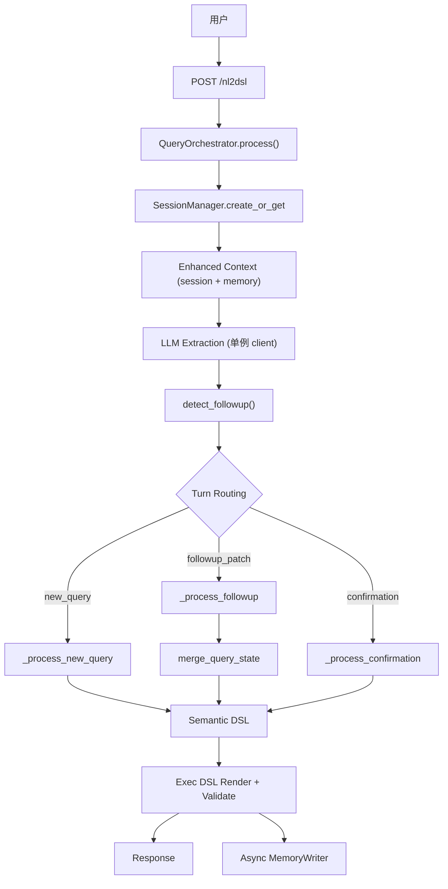
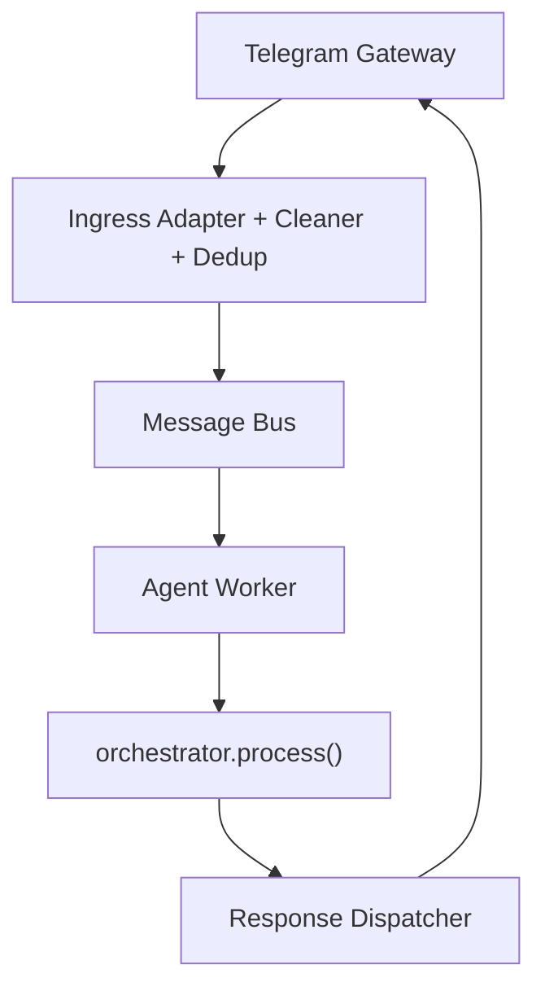

# Query Agent - 架构设计文档

## 全局约定

- **画图格式**: 所有架构图、流程图、时序图默认使用 Mermaid 格式（不使用 PlantUML）

## 1. 顶层分层架构

```text
┌──────────────────────────────────────────────────────────────┐
│                        Gateway Layer                        │
│   TelegramGateway · HTTP Client / FastAPI Entry            │
├──────────────────────────────────────────────────────────────┤
│                          API Layer                          │
│   app.py — 端点定义 · 全局服务实例化 · Telegram 通知         │
├──────────────────────────────────────────────────────────────┤
│                      Orchestrator Layer                     │
│   service/query_orchestrator.py — 三路径路由与业务编排       │
├──────────────────────────────────────────────────────────────┤
│                      Turn / State Layer                     │
│   session_manager.py · session_models.py                    │
│   task_manager.py · followup_resolver.py                    │
│   query_state_merger.py                                     │
├──────────────────────────────────────────────────────────────┤
│                      NL2DSL Pipeline                        │
│   llm_extractions.py (LLM 单例 + 多轮 patch 指令)           │
│   matcher_service.py + matchers (event/metric/dim/time)     │
│   semantic_models.py · renderer.py · validators.py          │
├──────────────────────────────────────────────────────────────┤
│                       Memory Layer                          │
│   long_term_memory.py (query-aware 相关性筛选)              │
│   memory_writer.py (hash 去重 + LLM judge)                  │
│   user_preference_store.py (log2 bias reranking)            │
├──────────────────────────────────────────────────────────────┤
│                   Persistence Layer                         │
│   JsonlStorage 基类 → SessionStorage / TaskStorage          │
│   JSONL compaction (500 行阈值自动压缩)                      │
├──────────────────────────────────────────────────────────────┤
│                   Runtime / System Layer                    │
│   bus/* · worker/* · dispatcher/* · server.py               │
└──────────────────────────────────────────────────────────────┘
```

### 分层说明

| 层级 | 模块 | 文件 | 职责 |
|------|------|------|------|
| **Gateway** | Telegram | `gateway/telegram_gateway.py` | Telegram 长轮询消息接收 |
| **API** | FastAPI | `app.py` | 端点定义、请求/响应模型、全局实例化 |
| **Orchestrator** | QueryOrchestrator | `service/query_orchestrator.py` | 三路径路由 (new_query/followup_patch/confirmation) |
| **Turn/State** | SessionManager | `service/session_manager.py` | 会话管理 + JSONL 持久化 + 定时清理 |
| | SessionModels | `service/session_models.py` | QueryState / SessionContext / TaskContext |
| | TaskManager | `service/task_manager.py` | 确认流管理 + TaskStorage 持久化 |
| | FollowupResolver | `service/followup_resolver.py` | 纯规则 follow-up 检测 |
| | QueryStateMerger | `service/query_state_merger.py` | patch 合并 + explicit/inherited 标记 |
| **NL2DSL** | LLM Extractions | `service/llm_extractions.py` | LLM 实体提取（模块级 client 单例） |
| | MatcherService | `matcher/matcher_service.py` | event/metric/dimension/time 解析 |
| | Semantic DSL | `dsl/semantic_models.py` | 语义 DSL 模型 |
| | Renderer | `dsl/renderer.py` | Exec DSL 渲染 |
| | Validators | `dsl/validators.py` | region 一致性校验 |
| **Memory** | LongTermMemory | `memory/long_term_memory.py` | 项目级记忆 + query-aware 筛选 |
| | MemoryWriter | `memory/memory_writer.py` | LLM 驱动记忆学习 + hash 去重 |
| | UserPreference | `memory/user_preference_store.py` | 用户偏好存储 + log2 bias |
| **Persistence** | JsonlStorage | `memory/storage/memory_file.py` | JSONL append-only + compaction |
| **Runtime** | Server | `server.py` | 生命周期 + 服务装配 |
| | Bus / Worker | `bus/` · `worker/` | 消息总线 + Worker |
| | Dispatcher | `dispatcher/` | 响应路由 |

### 依赖方向

```text
server.py
  ├─ gateway/*
  ├─ bus/*
  ├─ worker/*
  ├─ dispatcher/*
  └─ app.py
       └─ service/query_orchestrator.py
            ├─ service/session_manager.py
            ├─ service/task_manager.py
            ├─ service/followup_resolver.py
            ├─ service/query_state_merger.py
            ├─ service/llm_extractions.py (LLM client 单例)
            ├─ matcher/*
            ├─ dsl/*
            └─ memory/*
```

设计约束：
- `app.py` 只负责端点定义，业务逻辑委托给 `QueryOrchestrator`
- `server.py` 负责生命周期管理（含 session 定时清理 5min/60min）
- `matcher/*` 聚焦匹配与召回，不掺入 session 策略
- `memory/*` 提供可复用知识层和偏好信号

---

## 2. 核心数据流

### HTTP 路径



### Telegram / Bus 路径



Worker 直接调用 `orchestrator.process()`，不经过 FastAPI 端点。

---

## 3. Turn-Based Querying

### Turn 模式

系统区分三种 turn 模式：

| 模式 | 触发条件 | 处理方式 |
|------|---------|---------|
| `new_query` | 完整新查询 | 完整 LLM → Matcher → DSL 流程 |
| `followup_patch` | follow-up 检测命中 | 增量 patch → 合并上轮 state → DSL |
| `confirmation` | 低置信度候选等待确认 | 用户回复 → 确认值 → DSL |

### Follow-up 检测优先级

`detect_followup()` 纯规则判断，不依赖 LLM：

1. pending_task + 确认回复词（"1"、"第一个"） → `confirmation_reply`
2. 纯时间词（"今天"、"本周"） → `followup_patch` + patch_hints
3. 前缀词（"换成"、"那"、"对比"） → `followup_patch`
4. 比较短语（"和昨天比"、"同比"） → `followup_patch`
5. 短句 + 领域 token → `followup_patch`
6. 以上都不满足 → `new_query`

### QueryState 合并

`merge_query_state()` 将 patch 合并到上轮 QueryState：
- patch 中出现的字段 → `explicit`
- 上轮存在且 patch 未覆盖的 → `inherited`
- 输出 `field_sources` 字典记录每个字段来源

### 多轮查询示例

```text
Q1: 德国 app_launch 的 PV     → new_query
Q2: 昨天                       → followup_patch (time_only_term)
Q3: 改成 UV                    → followup_patch (followup_prefix)
Q4: 再按渠道拆一下             → followup_patch (short_patch)
Q5: 那美国呢                   → followup_patch (followup_prefix)
```

---

## 4. Memory 三层架构

### Session Memory

- 存储：JSONL append-only，支持 compaction（500 行阈值）
- 内容：`last_query_state`、`pending_task_id`、`turn_index`、`last_user_query`
- 特性：进程重启可恢复、定时清理不活跃 session（5 分钟检查，60 分钟过期）

### Project Memory (LongTermMemory)

- 存储：项目级 Markdown 文件 (`data/memory/project_{id}/`)
- 特性：query-aware 相关性筛选（CJK bigram + event/metric/region 关键词）
- 不再每轮注入全量 memory，只选 top 3 相关片段

### User Preference Signal

- 存储：JSON 文件 (`data/user_preferences/project_{id}__user_{user_id}.json`)
- 机制：记录用户选择频率，用 `log2(count+1) * 2` 作为 bias 加分（上限 6.0）
- 时机：resolve 后 rerank，不替代 matcher 主判断

---

## 5. Persistence

### JsonlStorage 基类

```text
JsonlStorage (基类)
  ├─ append() + fsync
  ├─ read_all() (容错跳过损坏行)
  ├─ _maybe_compact() (500 行阈值 → 保留 100 条 + 最新 state/meta)
  │
  ├─ SessionStorage
  │   ├─ read_tail()
  │   └─ read_last_state()
  │
  └─ TaskStorage
      ├─ read_latest()
      └─ list_by_session()
```

### Compaction 机制

- 每次 append 后检查行数
- 超过 500 行时：保留最近 100 条 + 所有 query_state / session_meta 记录
- 原子写入（先写 .tmp 再 replace）


---

## 6. 示例使用场景

### 场景 1: 首次查询

```json
POST /nl2dsl
{ "text": "德国的app_launch的PV", "project_id": 55 }

Response:
{ "status": "success", "session_id": "abc-123", "explain": { "turn_explain": { "mode": "new_query" } } }
```

### 场景 2: Follow-up 修改指标

```json
POST /nl2dsl
{ "text": "换成UV", "project_id": 55, "session_id": "abc-123" }

Response:
{ "status": "success", "explain": { "turn_explain": { "mode": "followup_patch", "applied_patch": { "metric": "uv" } } } }
```

### 场景 3: 确认流

```json
// 低置信度触发
POST /nl2dsl
{ "text": "<模糊event>", "project_id": 55 }
→ { "status": "needs_confirmation", "task_id": "xxx", "candidates": {...} }

// 用户确认
POST /nl2dsl
{ "text": "1", "session_id": "abc-123" }
→ { "status": "success", "explain": { "confirmed": {...} } }
```

---

## 7. 测试基础设施

### 测试框架

- 使用 `pytest`
- 配置文件：`pytest.ini`
- 共享 fixtures：`tests/conftest.py`

### 运行测试

```bash
pytest tests/ -v
```

### 测试文件清单

| 文件 | 覆盖模块 | 测试数量 |
|------|---------|---------|
| `test_session_storage.py` | `memory/storage/memory_file.py` — JSONL 持久化、容错、compaction | 15 |
| `test_long_term_memory.py` | `memory/long_term_memory.py` — 记忆注入、缓存、相关性筛选 | 12 |
| `test_task_manager.py` | `service/task_manager.py` — 确认流、持久化恢复、过期 | 23 |
| `test_session_manager.py` | `service/session_manager.py` — 会话管理、turn 追踪 | 19 |
| `test_followup_resolver.py` | `service/followup_resolver.py` — follow-up 检测各规则 | 8 |
| `test_query_state_merger.py` | `service/query_state_merger.py` — patch 合并、字段来源 | 6 |
| `test_app_endpoints.py` | `app.py` — HTTP 端点集成 | 23 |
| `test_matchers.py` | `matcher/` — 事件/指标/维度/时间匹配 | 29 |
| `test_user_preference_store.py` | `memory/user_preference_store.py` — 偏好存储 | 2 |
| `test_memory_writer.py` | `memory/memory_writer.py` — hash 去重 | 12 |
| `test_ingress.py` | `ingress/` — 清洗、去重、Telegram 适配 | 20 |
| `test_bus.py` | `bus/` — 消息总线、DirectCallBus | 11 |
| `test_end_to_end_evals.py` | 端到端 eval (YAML 驱动) | 多场景 |

### 关键测试场景

1. **Session recovery**：JSONL 写入 → create_or_get → 恢复 messages + query_state + turn_index
2. **Memory injection**：get_enhanced_context → query-aware 相关性筛选 → memory_corrections
3. **Follow-up detection**：纯时间词 / 前缀词 / 比较短语 / 短句模式
4. **QueryState merge**：explicit/inherited 标记、field_sources 追踪
5. **Confirmation flow**：低置信度 → needs_confirmation → 用户选择 → success
6. **JSONL compaction**：超过 500 行 → 自动压缩保留 100 条
7. **User preference bias**：多次选择 → log2 bias rerank
8. **JSONL 容错**：corrupted line → 跳过，不崩溃
