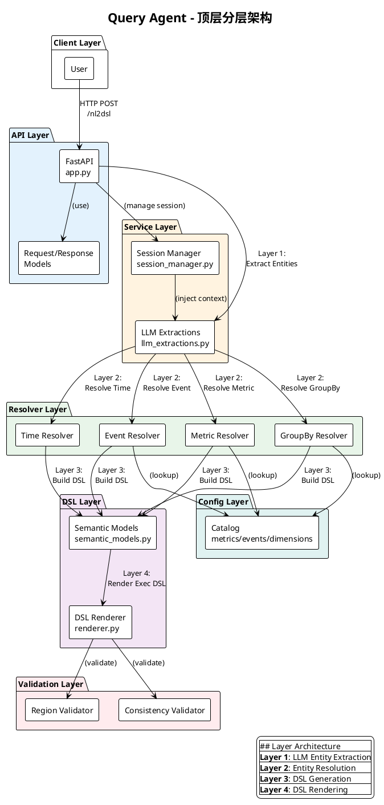

# Query Agent - 架构设计文档

## 0. 顶层分层架构

### 架构图
文件位置：`architecture.puml`



### 分层说明

| 层级 | 模块 | 文件 | 职责 |
|------|------|------|------|
| **Client** | User | - | 发起 HTTP 请求 |
| **API** | FastAPI | `app.py` | 请求处理、响应封装、会话管理 |
| **Service** | LLM Extractions | `service/llm_extractions.py` | LLM 实体提取 (Layer 1) |
| | Session Manager | `service/session_manager.py` | 会话上下文管理 |
| **Resolver** | Metric Resolver | `resolver/metric_resolver.py` | 指标解析 (Layer 2) |
| | Event Resolver | `resolver/event_resolver.py` | 事件解析 (Layer 2) |
| | GroupBy Resolver | `resolver/groupby_resolver.py` | 维度解析 (Layer 2) |
| | Time Resolver | `resolver/time_resolver.py` | 时间范围解析 (Layer 2) |
| **DSL** | Semantic Models | `dsl/semantic_models.py` | 语义 DSL 生成 (Layer 3) |
| | DSL Renderer | `dsl/renderer.py` | 执行 DSL 渲染 (Layer 4) |
| **Config** | Catalog | `catalog/*.yaml` | 配置数据 (指标/事件/维度) |
| **Validation** | Validators | `dsl/validators.py` | 结果验证 |

### 数据流

```
User Request
    ↓
API Layer (FastAPI)
    ↓
Service Layer (LLM Extractions) ← Session Context
    ↓
Resolver Layer (Metric/Event/GroupBy/Time)
    ↓
DSL Layer (Semantic Models → Renderer)
    ↓
Validation Layer
    ↓
Response
```

---

# Memory (会话记忆) 功能设计与实施计划

## 一、背景与目标

### 当前状态
- 系统**无会话管理**，每个请求独立处理
- 无法利用对话历史理解用户意图
- 多轮对话场景下用户体验较差（需要重复上下文）

### 目标
实现会话记忆功能，使系统能够：
1. 记录用户对话历史
2. 利用历史上下文理解当前查询
3. 支持多轮对话的上下文继承

---

## 二、架构设计

### 2.1 会话数据模型

**新建文件：`service/session_models.py`**

```python
from datetime import datetime
from typing import List, Optional, Dict, Any
from pydantic import BaseModel

class ConversationMessage(BaseModel):
    """单条对话消息"""
    role: str  # "user" or "assistant"
    content: str  # 用户输入或助手响应摘要
    timestamp: datetime
    metadata: Optional[Dict[str, Any]] = None  # 存储解析结果等

class UserSession(BaseModel):
    """用户会话"""
    session_id: str
    user_id: Optional[str] = None
    project_id: int
    messages: List[ConversationMessage] = []
    created_at: datetime
    last_active: datetime
    # 可选：存储用户偏好上下文
    context: Dict[str, Any] = {}
```

### 2.2 会话管理服务

**新建文件：`service/session_manager.py`**

```python
import uuid
from datetime import datetime
from typing import List, Optional
from service.session_models import UserSession, ConversationMessage

class SessionManager:
    """会话管理服务"""

    def __init__(self, storage_backend: str = "memory"):
        # 支持：memory, redis, file
        self.storage_backend = storage_backend
        self._sessions: Dict[str, UserSession] = {}

    def create_session(self, user_id: Optional[str], project_id: int) -> UserSession:
        """创建新会话"""
        session_id = str(uuid.uuid4())
        now = datetime.now()
        session = UserSession(
            session_id=session_id,
            user_id=user_id,
            project_id=project_id,
            created_at=now,
            last_active=now
        )
        self._sessions[session_id] = session
        return session

    def get_session(self, session_id: str) -> Optional[UserSession]:
        """获取会话"""
        return self._sessions.get(session_id)

    def add_message(self, session_id: str, role: str, content: str,
                    metadata: Optional[Dict] = None):
        """添加消息到会话"""
        session = self.get_session(session_id)
        if session:
            msg = ConversationMessage(
                role=role,
                content=content,
                timestamp=datetime.now(),
                metadata=metadata
            )
            session.messages.append(msg)
            session.last_active = datetime.now()

    def get_conversation_history(self, session_id: str,
                                  limit: int = 5) -> List[ConversationMessage]:
        """获取最近对话历史"""
        session = self.get_session(session_id)
        if session:
            return session.messages[-limit:]
        return []

    def get_context_summary(self, session_id: str) -> Dict[str, Any]:
        """获取会话上下文摘要（用于注入 LLM）"""
        history = self.get_conversation_history(session_id, limit=3)
        context = {
            "recent_queries": [m.content for m in history if m.role == "user"],
            "resolved_entities": self._extract_resolved_entities(session_id)
        }
        return context

    def _extract_resolved_entities(self, session_id: str) -> Dict[str, Any]:
        """从历史对话中提取已解析的实体"""
        session = self.get_session(session_id)
        if not session:
            return {}

        # 从历史消息的 metadata 中提取实体
        entities = {
            "regions": set(),
            "metrics": set(),
            "events": set()
        }

        for msg in session.messages:
            if msg.metadata:
                if "region" in msg.metadata:
                    entities["regions"].add(msg.metadata["region"])
                if "metric" in msg.metadata:
                    entities["metrics"].add(msg.metadata["metric"])

        return {k: list(v) for k, v in entities.items()}
```

### 2.3 API 层修改

**修改文件：`app.py`**

```python
# 新增导入
from service.session_manager import SessionManager
from typing import Optional

# 全局会话管理器
session_manager = SessionManager(storage_backend="memory")

# 修改请求模型
class NL2DSLRequest(BaseModel):
    text: str
    project_id: int = Field(default=55)
    user_id: Optional[str] = None
    session_id: Optional[str] = None  # 新增：会话ID

# 修改响应模型
class NL2DSLResponse(BaseModel):
    extraction_json: Dict[str, Any]
    semantic: Dict[str, Any]
    exec_dsl: Dict[str, Any]
    explain: Dict[str, Any]
    session_id: Optional[str] = None  # 新增：返回会话ID

# 修改主处理函数
@app.post("/nl2dsl", response_model=NL2DSLResponse)
def nl2dsl(req: NL2DSLRequest) -> NL2DSLResponse:
    # 会话处理
    session_id = req.session_id
    if not session_id:
        session = session_manager.create_session(req.user_id, req.project_id)
        session_id = session.session_id
    else:
        session = session_manager.get_session(session_id)
        if not session:
            session = session_manager.create_session(req.user_id, req.project_id)
            session_id = session.session_id

    # 获取会话上下文
    session_context = session_manager.get_context_summary(session_id)

    # Layer1: 传入会话上下文
    extraction_json = extract_llm(req.text, session_context=session_context)

    # ... 原有处理逻辑 ...

    # 记录用户消息
    session_manager.add_message(
        session_id,
        role="user",
        content=req.text,
        metadata={
            "region": region_filter,
            "metric": metric_id,
            "event": event_name
        }
    )

    return NL2DSLResponse(
        # ... 原有返回 ...
        session_id=session_id
    )
```

### 2.4 LLM 层修改

**修改文件：`service/llm_extractions.py`**

```python
def extract_llm(query: str, session_context: Optional[Dict[str, Any]] = None) -> ExtractionsJson:
    """
    LLM 提取实体

    Args:
        query: 用户查询文本
        session_context: 会话上下文，包含历史对话和已解析实体
    """
    llm = get_llm()

    # 构建带上下文的提示词
    context_prompt = _build_context_prompt(session_context)

    chain = context_prompt | llm
    resp = chain.invoke({"query": query})
    # ... 原有解析逻辑 ...

def _build_context_prompt(session_context: Optional[Dict[str, Any]]) -> ChatPromptTemplate:
    """构建带会话上下文的提示词"""
    base_system = """你是一个..."""

    context_instruction = ""

    if session_context and session_context.get("recent_queries"):
        context_instruction = r"""

=== 对话历史 ===
"""
        for i, prev_query in enumerate(session_context["recent_queries"], 1):
            context_instruction += f"Q{i}: {prev_query}\n"

        if session_context.get("resolved_entities"):
            entities = session_context["resolved_entities"]
            if entities.get("regions"):
                context_instruction += f"\n已识别地区: {', '.join(entities['regions'])}"
            if entities.get("metrics"):
                context_instruction += f"\n已识别指标: {', '.join(entities['metrics'])}"

        context_instruction += "\n=== 历史结束 ===\n\n"
        context_instruction += "请参考上述对话历史，理解用户当前问题的完整意图。"

    return ChatPromptTemplate.from_messages([
        ("system", base_system + context_instruction),
        ("human", "用户问题：\n{query}\n\n返回 JSON："),
    ])
```

---

## 三、实施步骤

### Phase 1: 创建数据模型与会话管理 (优先级: 高)

| 步骤 | 文件 | 内容 |
|------|------|------|
| 1.1 | `service/session_models.py` | 创建会话数据模型 |
| 1.2 | `service/session_manager.py` | 实现内存版本 SessionManager |
| 1.3 | `tests/test_session_manager.py` | 编写单元测试 |

### Phase 2: API 层集成 (优先级: 高)

| 步骤 | 文件 | 修改内容 |
|------|------|----------|
| 2.1 | `app.py` | 添加 session_id 到请求/响应模型 |
| 2.2 | `app.py` | 集成 SessionManager |
| 2.3 | `app.py` | 在 nl2dsl 函数中处理会话逻辑 |

### Phase 3: LLM 层改造 (优先级: 高)

| 步骤 | 文件 | 修改内容 |
|------|------|----------|
| 3.1 | `service/llm_extractions.py` | 修改 extract_llm 函数签名 |
| 3.2 | `service/llm_extractions.py` | 实现 _build_context_prompt |
| 3.3 | `service/llm_extractions.py` | 将上下文注入 LLM 提示词 |

### Phase 4: 持久化存储 (优先级: 中)

| 步骤 | 文件 | 内容 |
|------|------|------|
| 4.1 | `service/storage_backend.py` | 定义存储接口 |
| 4.2 | `service/redis_storage.py` | 实现 Redis 后端 |
| 4.3 | `service/file_storage.py` | 实现文件后端 |
| 4.4 | 配置 | 添加存储配置选项 |

### Phase 5: 测试验证 (优先级: 中)

| 步骤 | 内容 |
|------|------|
| 5.1 | 单元测试：SessionManager |
| 5.2 | 集成测试：多轮对话场景 |
| 5.3 | 端到端测试：验证上下文继承 |

---

## 四、关键文件清单

### 需要新建的文件

```
service/
├── session_models.py      # 会话数据模型
├── session_manager.py      # 会话管理服务
├── storage_backend.py      # 存储接口定义 (Phase 4)
├── redis_storage.py        # Redis 存储 (Phase 4)
└── file_storage.py         # 文件存储 (Phase 4)

tests/
└── test_session_manager.py # 会话管理测试
```

### 需要修改的文件

```
app.py                      # API 层集成
service/llm_extractions.py  # LLM 层改造
requirements.txt            # 可能需要新增依赖 (Phase 4)
```

---

## 五、示例使用场景

### 场景 1: 首次请求
```json
POST /nl2dsl
{
  "text": "德国的PV",
  "project_id": 55
}

Response:
{
  "extraction_json": {...},
  "semantic": {...},
  "exec_dsl": {...},
  "explain": {...},
  "session_id": "abc-123-def"  // 返回新会话ID
}
```

### 场景 2: 后续请求（带上下文）
```json
POST /nl2dsl
{
  "text": "对比昨天的数据",  // 系统理解"昨天"基于德国PV的上下文
  "project_id": 55,
  "session_id": "abc-123-def"  // 传入会话ID
}

Response:
{
  // ... 系统利用上下文生成正确的查询
}
```

---

## 六、依赖项

### Python 包 (Phase 4 需要)
```
# requirements.txt 新增
redis>=5.0.0        # Redis 存储 (可选)
```

---

## 七、注意事项

1. **向后兼容**：`session_id` 为可选参数，不影响现有无状态调用
2. **上下文窗口**：限制历史消息数量，避免超出 LLM token 限制
3. **隐私安全**：生产环境需考虑用户数据加密
4. **扩展性**：存储接口设计支持多种后端（内存/Redis/数据库）

---

## 八、后续优化方向

1. **智能上下文摘要**：使用 LLM 生成对话摘要，节省 token
2. **用户偏好学习**：记录用户常用的 metric/event/region
3. **会话过期策略**：自动清理长期不活跃的会话
4. **跨会话记忆**：持久化用户级别的偏好设置
