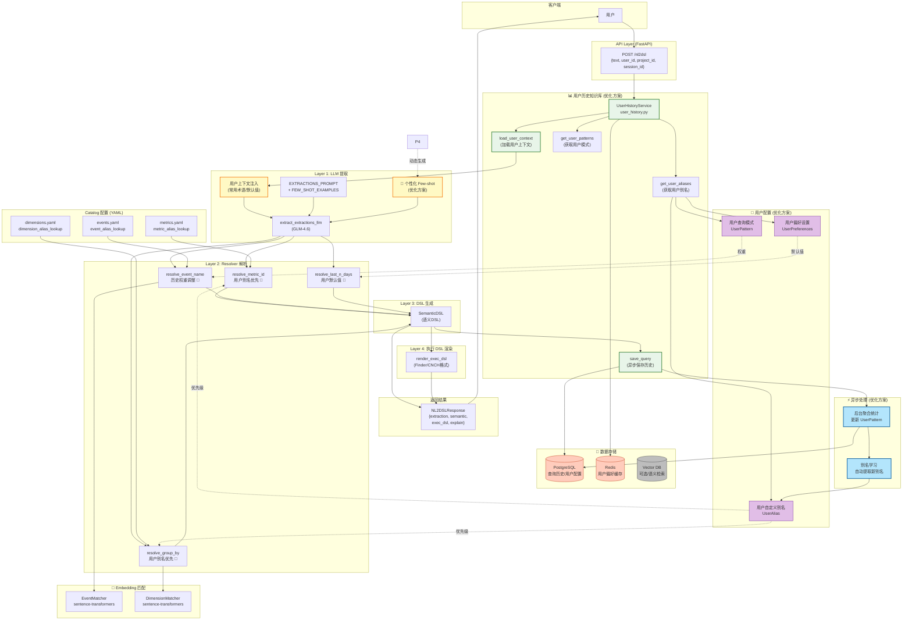
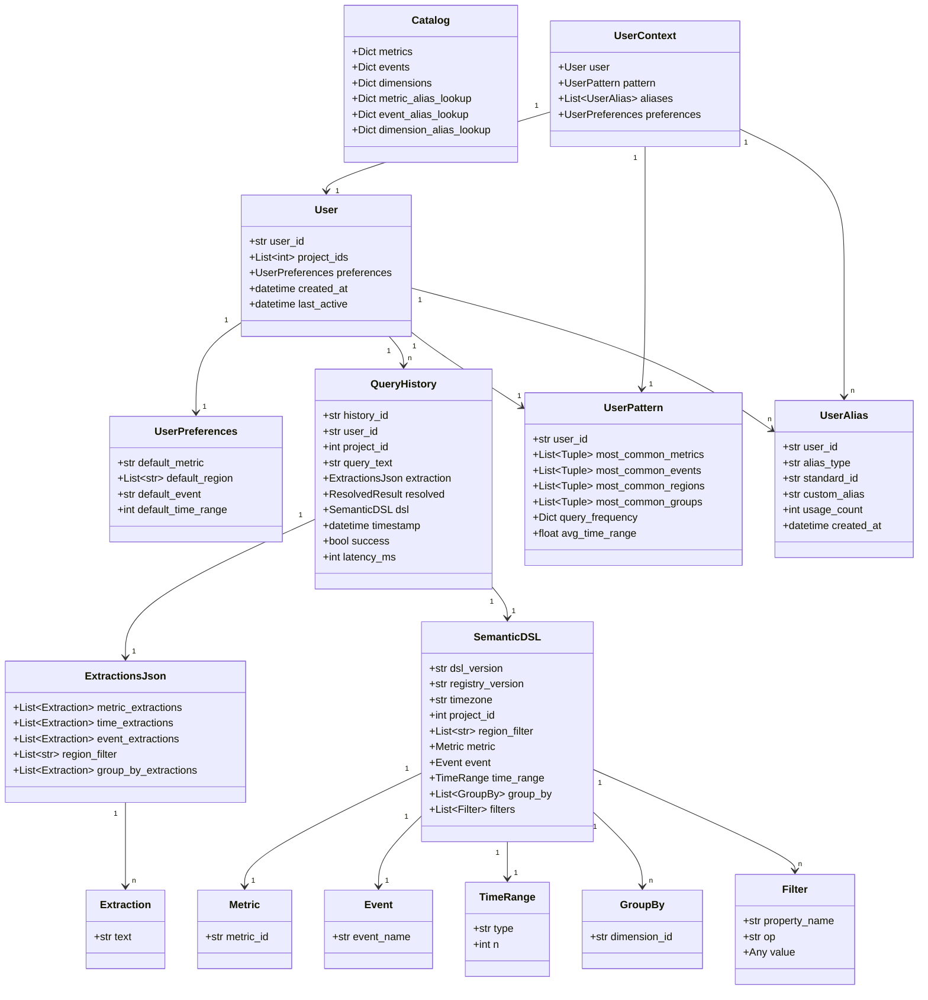
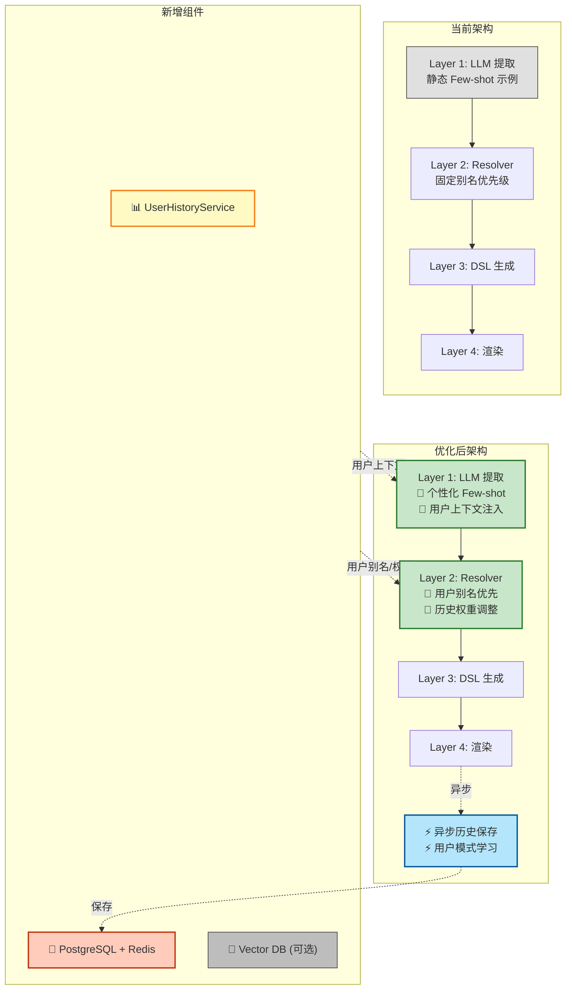
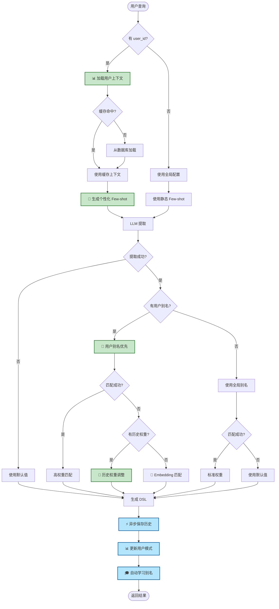

# NL2DSL Agent 完整架构图 (当前 + 优化方案)

## 整体架构图



---

## 完整时序图 (当前 + 优化方案)

```mermaid
sequenceDiagram
    autonumber
    actor User as 用户
    participant API as FastAPI<br/>app.py
    participant HS as UserHistoryService<br/>(优化方案)
    participant Cache as Redis<br/>缓存
    participant DB as PostgreSQL<br/>历史存储
    participant LLM as LLM Service<br/>llm_extractions.py
    participant RES as Resolver Layer<br/>resolver/
    participant CAT as Catalog<br/>catalog_loader.py
    participant EMB as Embedding Matcher<br/>Event/Dimension Matcher
    participant DSL as DSL Layer<br/>dsl/
    participant ASYNC as 异步处理<br/>(优化方案)

    User->>API: POST /nl2dsl<br/>{text, user_id, project_id}

    rect rgb(200, 255, 200)
        Note over API,DB: 📊 用户历史知识库 (优化方案)
        API->>HS: load_user_context(user_id)

        par 并行加载
            HS->>Cache: 查询用户偏好
        and
            HS->>DB: 查询用户历史
        end

        alt 缓存命中
            Cache-->>HS: UserContext
        else 缓存未命中
            DB-->>HS: UserContext
            HS->>Cache: 写入缓存
        end

        HS-->>API: UserContext<br/>{preferences, patterns, aliases}
    end

    rect rgb(255, 255, 200)
        Note over API,LLM: 🎯 Layer 1: 个性化 LLM 提取
        API->>HS: get_user_patterns(user_id)
        HS-->>API: UserPattern

        API->>LLM: extract_extractions_llm(text, user_context)

        par 并行处理
            LLM->>LLM: 生成个性化 Few-shot 示例
        and
            LLM->>LLM: 注入用户常用术语
        end

        LLM-->>API: ExtractionsJson
    end

    rect rgb(200, 200, 255)
        Note over API,EMB: Layer 2: Resolver 解析 (用户优先)
        API->>HS: get_user_aliases(user_id)
        HS-->>API: UserAliases

        par 并行解析
            API->>RES: resolve_metric_id(catalog, extraction, user_aliases)
            RES->>CAT: 用户别名优先
            alt 用户别名匹配
                CAT-->>RES: 用户定义的 metric_id
            else 全局别名
                CAT-->>RES: 全局 metric_id
            end
        and
            API->>RES: resolve_event_name(catalog, extraction, user_patterns)
            RES->>CAT: event_alias_lookup
            CAT-->>RES: event_id
            alt 未匹配
                RES->>EMB: EventMatcher.match()
                EMB-->>RES: event_id + score
            end
        and
            API->>RES: resolve_group_by(catalog, extraction, user_aliases)
            RES->>CAT: 用户别名优先
            CAT-->>RES: dimension_id
            alt 未匹配
                RES->>EMB: DimensionMatcher.match()
                EMB-->>RES: dimension_id + score
            end
        and
            API->>RES: resolve_last_n_days(extraction, user_preferences)
            alt 用户有默认值
                RES-->>API: 用户默认 n_days
            else 正则匹配
                RES-->>API: 匹配的 n_days
            end
        end

        RES-->>API: resolved results
    end

    rect rgb(255, 200, 200)
        Note over API: Layer 3-4: DSL 生成与渲染
        API->>DSL: SemanticDSL(...)
        DSL-->>API: SemanticDSL
        API->>DSL: render_exec_dsl(semantic, catalog)
        DSL-->>API: exec_dsl
    end

    rect rgb(200, 255, 255)
        Note over API,ASYNC: ⚡ 异步保存 (优化方案)
        API->>HS: save_query(record)
        HS->>DB: INSERT query_history

        par 后台异步处理
            DB->>ASYNC: 触发聚合
            ASYNC->>DB: 更新 UserPattern
        and
            ASYNC->>ASYNC: 别名学习
            ASYNC->>DB: 发现新别名
        end
    end

    API-->>User: NL2DSLResponse

    style HS fill:#c8e6c9,stroke:#2e7d32,stroke-width:2px
    style ASYNC fill:#b3e5fc,stroke:#01579b,stroke-width:2px,dash:3
```

---

## 数据模型完整图 (当前 + 优化方案)



---

## 分层架构对比图



---

## 决策流程图 (加入用户历史)



---

## 图例说明

| 图标/颜色 | 含义 |
|----------|------|
| 📊 绿色 | 用户历史知识库服务 |
| 🎯 黄色 | 个性化优化点 |
| 💾 橙色 | 数据存储 |
| 🔮 紫色 | Embedding 匹配 |
| ⚡ 蓝色虚线 | 异步处理 |
| 🎓 学习 | 自动别名学习 |
| 📝 紫色 | 用户配置 |
