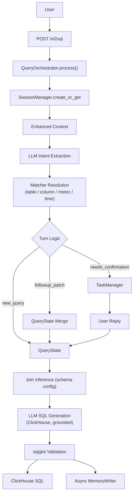
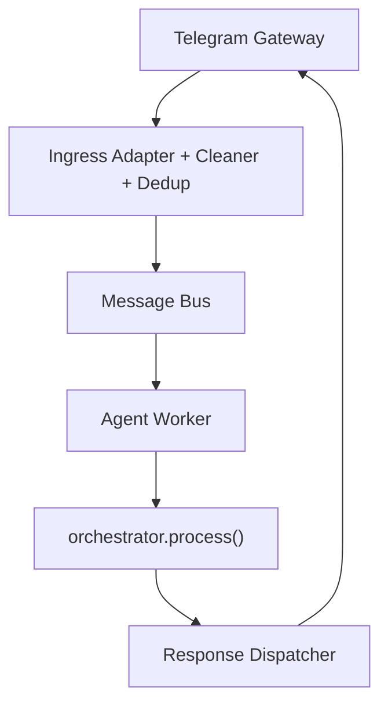
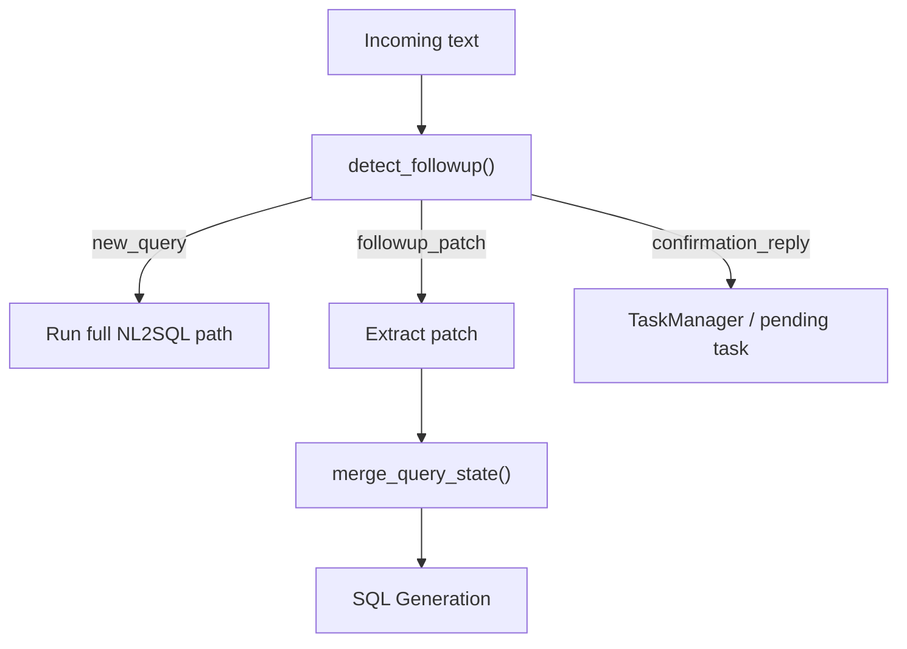
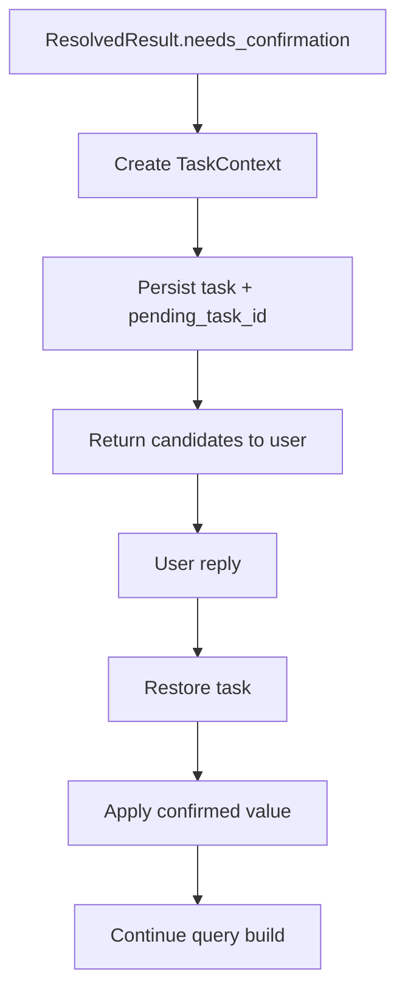

[Chinese version](https://github.com/frankzh0330/query-agent/blob/master/docs/ARCHITECTURE.zh-CN.md)

This document summarizes the current architecture of `query-agent`, the responsibility of each major module, and the intended dependency direction between layers.

## Layered View

```text
┌──────────────────────────────────────────────────────────────┐
│                      Gateway Layer                          │
│   TelegramGateway · HTTP Client / FastAPI Entry            │
├──────────────────────────────────────────────────────────────┤
│                        API Layer                            │
│   app.py                                                    │
│   endpoint defs · global service wiring · delegates to       │
│   QueryOrchestrator                                         │
├──────────────────────────────────────────────────────────────┤
│                     Turn / State Layer                      │
│   session_manager.py · session_models.py                    │
│   task_manager.py · followup_resolver.py                    │
│   query_state_merger.py                                     │
├──────────────────────────────────────────────────────────────┤
│                     NL2SQL Pipeline                         │
│   llm_extractions.py                                        │
│   matcher_service.py + table/column/metric matchers         │
│   sql_generator.py · sql_validator.py                       │
├──────────────────────────────────────────────────────────────┤
│                     Memory Layer                            │
│   long_term_memory.py · memory_writer.py                    │
│   user_preference_store.py                                  │
├──────────────────────────────────────────────────────────────┤
│                  Runtime / System Layer                     │
│   bus/* · worker/* · dispatcher/* · server.py               │
└──────────────────────────────────────────────────────────────┘
```

## Dependency Direction

Core rule: dependencies flow downward.

```text
server.py
  ├─ gateway/*
  ├─ bus/*
  ├─ worker/*
  ├─ dispatcher/*
  └─ app.py
       └─ service/query_orchestrator.py
            ├─ service/session_manager.py
            ├─ service/task_manager.py
            ├─ service/followup_resolver.py
            ├─ service/query_state_merger.py
            ├─ service/llm_extractions.py
            ├─ matcher/*
            ├─ service/sql_generator.py
            ├─ service/sql_validator.py
            └─ memory/*
```

Guidelines:

- `app.py` owns endpoint definitions and global wiring; business logic delegates to `QueryOrchestrator`.
- `server.py` owns startup wiring and lifecycle, not query semantics.
- `matcher/*` should stay focused on matching/retrieval, not session policy.
- `memory/*` should provide reusable signal/knowledge layers, not FastAPI behavior.

## Top-Level Runtime

### HTTP Path



### Telegram / Bus Path



## NL2SQL Pipeline

### Layer 1: LLM Extraction

Owned by [service/llm_extractions.py](https://github.com/frankzh0330/query-agent/blob/master/service/llm_extractions.py).

Responsibilities:

- turn user text into structured extraction objects
- inject session context and selected project memory
- use follow-up-aware prompt wording to avoid rebuilding full state when patching

Input:

- `text`
- recent session context
- `last_query_state`
- selected `memory_corrections`

Output:

- `SQLIntentJson` (table / metric / column / filter / group_by / time / order / window fragments)

### Layer 2: Matcher Resolution

Owned by [matcher/matcher_service.py](https://github.com/frankzh0330/query-agent/blob/master/matcher/matcher_service.py) and concrete matchers
([table_matcher.py](https://github.com/frankzh0330/query-agent/blob/master/matcher/table_matcher.py), [column_matcher.py](https://github.com/frankzh0330/query-agent/blob/master/matcher/column_matcher.py),
[sql_metric_matcher.py](https://github.com/frankzh0330/query-agent/blob/master/matcher/sql_metric_matcher.py), [time_matcher.py](https://github.com/frankzh0330/query-agent/blob/master/matcher/time_matcher.py)),
built on [matcher/base.py](https://github.com/frankzh0330/query-agent/blob/master/matcher/base.py) (IDF-weighted inverted index + edit-distance typo probing + RapidFuzz rerank + synonyms) over
[matcher/schema_loader.py](https://github.com/frankzh0330/query-agent/blob/master/matcher/schema_loader.py) metadata.

Responsibilities:

- resolve `table / table.column / metric_id / time_range` with scores and candidates
- threshold policy (deterministic, no LLM), calibrated per entity type: metric auto-accepts at >= 90 (a wrong metric means wrong numbers), table/column at >= 80; scores in [40, threshold) require confirmation; < 40 drops or falls back. A tie guard additionally forces confirmation when the top-2 candidate margin is < 10, even above the acceptance line
- recall is IDF-weighted (BM25-lite) so discriminative tokens outrank generic ones (table/amount/id) on tied hit counts, and zero-hit tokens >= 4 chars get an edit-distance-1 vocab probe ('orde tablez' -> orders) at 0.75x weight
- exact-alias collisions (same alias on multiple entities, e.g. `amount` on orders/payments, `time` on three tables) are detected at index build and surfaced at query time: two-way column collisions with a base-table context resolve deterministically by join-graph distance (nearest wins, e.g. `region` in an orders context -> users.region); 3-way generic tokens or ties escalate to the confirmation flow with all candidates — never silent first-wins
- infer the main table when the user does not name one (metric expression or column ownership)
- infer join steps from declarative `joins:` config; missing paths escalate to confirmation

Important detail:

- user preference is applied **after recall** as a small rerank signal
- matcher itself remains the main semantic resolver

### Layer 3: SQL Generation

Owned by [service/sql_generator.py](https://github.com/frankzh0330/query-agent/blob/master/service/sql_generator.py).

Responsibilities:

- assemble the generation prompt from resolved entities: base table, metric expressions,
  qualified columns, filters, time predicate (ClickHouse syntax), join conditions, window/order intent
- window-intent recovery: when L1 truncates the window fragment (e.g. extracts only "in each region", leaving "top 3" in the original sentence), the parser retries on the full query text — recovering limit and group deterministically (recorded in explain as `recovered_from_full_text`)
- call the LLM to produce one ClickHouse SELECT; entity names are pinned by the prompt, the LLM
  assembles structure only (GROUP BY / JOIN / `LIMIT n BY` grouped ranking)
- repair loop: failed validation feeds the error back into the next round (max 2 extra rounds)

### Layer 4: Validation

Owned by [service/sql_validator.py](https://github.com/frankzh0330/query-agent/blob/master/service/sql_validator.py) (sqlglot, `dialect="clickhouse"`).

Responsibilities:

- single read-only statement (SELECT / WITH only)
- all table references must be in the schema whitelist
- default LIMIT injection
- deterministic guardrails, independent of the LLM

## Turn-Based Querying

Turn-based behavior is a first-class part of the architecture, not a prompt trick.

### Core Building Blocks

- [service/session_models.py](https://github.com/frankzh0330/query-agent/blob/master/service/session_models.py)
  - `QueryState`
  - `SessionContext`
  - `TaskContext`
- [service/followup_resolver.py](https://github.com/frankzh0330/query-agent/blob/master/service/followup_resolver.py)
- [service/query_state_merger.py](https://github.com/frankzh0330/query-agent/blob/master/service/query_state_merger.py)
- [service/task_manager.py](https://github.com/frankzh0330/query-agent/blob/master/service/task_manager.py)

### Turn Modes

The system distinguishes:

- `new_query`
- `followup_patch`
- `confirmation`

### Follow-Up Flow



### Why This Matters

This supports queries like:

```text
Q1: Show PV for app_launch in Germany
Q2: Yesterday
Q3: Change it to UV
Q4: Break it down by channel
Q5: What about the US?
```

without forcing the user to restate all fields on every turn.

## Memory Architecture

The project now effectively has three memory layers.

### 1. Session Memory

Owned by:

- [service/session_manager.py](https://github.com/frankzh0330/query-agent/blob/master/service/session_manager.py)
- [service/session_models.py](https://github.com/frankzh0330/query-agent/blob/master/service/session_models.py)

Stores:

- `last_query_state`
- `pending_task_id`
- recent messages
- turn metadata

Purpose:

- follow-up patching
- confirmation continuation
- session restart recovery

### 2. Project Memory

Owned by [memory/long_term_memory.py](https://github.com/frankzh0330/query-agent/blob/master/memory/long_term_memory.py).

Stores:

- project-specific corrections
- business constraints
- default mappings
- domain caveats

Important detail:

- memory is loaded from `project_{id}/MEMORY.md`
- current query text is used to select more relevant memory snippets
- the system no longer needs to inject every project memory fragment on every turn

### 3. User Preference Signal

Owned by [memory/user_preference_store.py](https://github.com/frankzh0330/query-agent/blob/master/memory/user_preference_store.py).

Stores:

- user-scoped `event / metric / group_by` usage counts
- scoped by `project_id + user_id`

Purpose:

- rerank top candidates after recall
- never replace matcher semantics
- keep preference as a weak signal, not a primary resolver

## Confirmation Flow

Low-confidence ambiguity is handled by explicit confirmation, not silent guessing.

### Confirmation Lifecycle



### Persistence

Session state and task state are persisted separately:

- session: JSONL append-only session log
- task: JSONL append-only task log
- JSONL compaction: auto-compress when exceeding 500 lines, keeping 100 most recent + latest state/meta

This allows:

- process restart recovery
- delayed confirmation in chat channels
- long-running deployments without unbounded disk growth

## Async Memory Learning

Owned by [memory/memory_writer.py](https://github.com/frankzh0330/query-agent/blob/master/memory/memory_writer.py).

Responsibilities:

- asynchronously judge whether a successful query contains reusable knowledge
- append learned memory into project-scoped files
- maintain `MEMORY.md` index automatically

This is intentionally sidecar behavior:

- non-blocking
- failure-tolerant
- should not break the main query path

## System Components

### `app.py`

Responsibilities:

- request/response models
- global service instantiation (SessionManager, TaskManager, QueryOrchestrator)
- endpoint definitions (delegates to QueryOrchestrator)
- Telegram notification helper

### `server.py`

Responsibilities:

- application lifespan
- matcher service initialization (schema loading + index build)
- bus / worker / dispatcher wiring
- Telegram gateway startup
- session periodic cleanup (5 min interval, 60 min expiry)

### `gateway/*`, `ingress/*`, `bus/*`, `worker/*`, `dispatcher/*`

Responsibilities:

- channel adaptation
- message cleaning and dedup
- async request transport
- worker consumption
- response routing

These components let the agent run as more than a plain HTTP API.

## Architecture Scenarios

The following scenarios are useful when validating the architecture end to end.
They are intentionally written as behavior-level examples rather than unit-test
details.

### Scenario 1: First Query

```json
POST /nl2sql
{
  "text": "Revenue by region for the last 7 days",
  "project_id": 55
}
```

Expected behavior:

- creates or restores a session
- runs the full `new_query` path
- resolves metric / time / group-by column, infers the main table (`revenue -> orders`),
  and infers the join to `users` for `users.region`
- generates and validates ClickHouse SQL
- returns `status=success`
- persists `last_query_state` for later turns

### Scenario 2: Follow-Up Patch

```json
POST /nl2sql
{
  "text": "Change to order count",
  "project_id": 55,
  "session_id": "abc-123"
}
```

Expected behavior:

- detects `followup_patch`
- keeps inherited fields such as tables and time range
- applies only the metrics patch
- records field sources as `explicit` or `inherited`

### Scenario 3: Time-Only Follow-Up

```text
Q1: Revenue by region for the last 7 days
Q2: Yesterday
```

Expected behavior:

- keeps `tables=[orders]`
- keeps `metrics=[revenue]`
- keeps the previous group-by
- changes only the time range

This is the canonical reason `last_query_state` must be structured instead of a
plain text chat summary.

### Scenario 4: Confirmation Flow

```json
POST /nl2sql
{
  "text": "Show revenue for the product table",
  "project_id": 55
}
```

If table resolution is ambiguous, the system should return:

```json
{
  "status": "needs_confirmation",
  "task_id": "xxx",
  "candidates": {
    "tables": [
      { "value": "products", "score": 55.0 },
      { "value": "orders", "score": 48.0 }
    ]
  }
}
```

Then a reply such as:

```json
POST /nl2sql
{
  "text": "1",
  "session_id": "abc-123"
}
```

should restore the pending task, apply the confirmed candidate, continue SQL
generation, and clear `pending_task_id`.

### Scenario 5: Project Memory Injection

```text
Project memory:
In project_55, activation means activation_success by default.

User query:
Show activation PV yesterday
```

Expected behavior:

- loads only memory scoped to `_global` and `project_55`
- selects relevant project memory snippets
- injects those snippets before LLM extraction
- keeps this rule separate from user preference

### Scenario 6: User Preference Rerank

```text
User history:
user_a often selects payment_submit in project_55.

Current query:
Show payment event PV.
```

Expected behavior:

- matcher recall still produces the candidate set
- user preference applies only after recall
- preference can nudge `payment_submit` upward
- preference must not override a stronger explicit semantic match

### Scenario 7: Restart Recovery

```text
Turn 1: ambiguous query returns needs_confirmation
Process restarts
Turn 2: user replies "1"
```

Expected behavior:

- session storage restores `pending_task_id`
- task storage restores the unresolved confirmation task
- the confirmation reply completes the query instead of starting a new query

## Validation and Debugging

The system exposes rich explain/debug information:

- `resolver_explain`
- `turn_explain`
- candidate scores
- follow-up decision signals
- patch fields
- confirmed fields
- timing for major layers

This is important because the project is closer to an agent than a one-shot translator.

## Evaluation Strategy

The project uses both regular tests and data-driven end-to-end evals.

### End-to-End Eval Harness

Owned by:

- [tests/evals/nl2sql_cases.yaml](https://github.com/frankzh0330/query-agent/blob/master/tests/evals/nl2sql_cases.yaml)
- [tests/test_end_to_end_evals.py](https://github.com/frankzh0330/query-agent/blob/master/tests/test_end_to_end_evals.py)

Current coverage includes:

- basic new query
- follow-up patch
- follow-up + confirmation
- project memory injection
- restart + confirmation recovery

This is intentionally closer to “golden cases” than isolated unit tests.

The pytest harness mocks the LLM extraction and SQL generation, so it evaluates matcher resolution,
state merging, the confirmation flow and the inputs handed to SQL generation, and it runs offline in seconds.
Cases marked `xfail` assert the *correct* behavior for known gaps (strict, so a fix forces the marker off).

### Live LLM Eval

[scripts/live_eval.py](https://github.com/frankzh0330/query-agent/blob/master/scripts/live_eval.py) replays the same cases against the real LLM and reports
per-case pass/fail, SQL static validity, whether the resolved metric expressions appear in the SQL, and latency.
It measures what the mocked harness cannot (extraction and SQL quality). LLM output varies between runs, so a
result is a sample, not a stable accuracy figure, and "SQL is valid" does not mean "SQL is correct".

## Catalog and Metadata

The checked-in YAML catalog is mainly a demo/development artifact.

The intended production direction is:

- metadata fetched from HTTP source
- synced into local catalog
- matcher indexes rebuilt on refresh

This matters because real deployments may have:

- tens of thousands of events
- multiple dimensions/properties per event
- project-specific vocabularies and constraints

## Filter Value Resolution

A filter such as "paid by credit card" has two parts to resolve: the **column**
(`payments.payment_type`) and the **value** (`credit_card`). The LLM only copies the
user's words, so the value it extracts (`credit card`) rarely equals what is stored.
Getting this wrong produces SQL that passes static validation but returns nothing or the
wrong rows, which the live eval surfaced (see [Evaluation Strategy](#evaluation-strategy)).

### What this repository does

- **Column**: [orchestrator](https://github.com/frankzh0330/query-agent/blob/master/service/query_orchestrator.py) accepts a filter column only on a
  high-confidence match (score >= 80). Low-confidence or unmatched columns are never guessed
  from the recall list; the request ends with `early_exit` and the closest columns, so the user
  can rephrase. (A hallucinated `user_type` used to be fuzzy-matched to `orders.user_id`.)
- **Value**: columns may declare `enum_values` in [catalog/sql_schema.yaml](https://github.com/frankzh0330/query-agent/blob/master/catalog/sql_schema.yaml).
  `SQLSchema.normalize_enum_value()` maps the extracted value to a declared one
  deterministically: exact, then case/space/hyphen-insensitive (`Credit-Card` -> `credit_card`),
  then RapidFuzz >= 90 (`cancelled` -> `canceled`). A value that matches nothing is passed through and
  recorded in `explain`; it does not block the query.

### Why hand-written enums do not scale

`enum_values` fits low-cardinality, stable columns (`status`, `payment_type`, `vip_level`).
It does not fit high-cardinality or changing columns (brand, city, product name), and nobody can
maintain a hand-written list for every column of a real warehouse. It is a demo-scale choice.

### How production systems approach it

| Approach | Idea | Reference |
|---|---|---|
| Cached frequent values + fuzzy match | Pick searchable text columns by cardinality/type, cache the most frequent values, match filters with edit distance, generate synonyms/abbreviations with an LLM | [SQLGenie (ACL 2025 Industry)](https://aclanthology.org/2025.acl-industry.71.pdf) |
| Index all values | LSH plus semantic embeddings, hierarchical retrieval; give the LLM only the relevant value subset (offline index, online retrieval) | [CHESS](https://scalingintelligence.stanford.edu/pubs/CHESSpaper.pdf), [XiYan-SQL](https://arxiv.org/pdf/2411.08599), [DeepEye-SQL](https://arxiv.org/pdf/2510.17586) |
| Sample values in the prompt | 3-5 representative values for low-cardinality categorical columns | [DexterSQL](https://arxiv.org/pdf/2608.11889) |
| Semantic-layer aliases | Humans maintain metric, dimension and value aliases/synonyms, backed by golden-query regression tests | [Semantic Layers Make Enterprise Text-to-SQL Safer](https://datalakehousehub.com/blog/2026-05-semantic-layers-text-to-sql/), [dbt: Semantic Layer vs. Text-to-SQL](https://docs.getdbt.com/blog/semantic-layer-vs-text-to-sql-2026) |

These are usually combined: low-cardinality columns get sample values or a cached list, high-cardinality
columns get a value index, and business vocabulary lives in the semantic layer.

The public material is thin on operational details (how values that change over time are refreshed, how
ambiguous values are disambiguated with the user). Treat those as open design questions, not established practice.

### Intended direction for this project

Replace the hand-written `enum_values` with values synced from the warehouse (distinct/top-K per eligible column,
refreshed on the same schedule as the metadata sync), keep `normalize_enum_value()` as the deterministic
first pass, and add an embedding or LSH value index for high-cardinality columns. Ambiguous or unmatched values should
go through the confirmation flow instead of being passed through.

## Evolution Roadmap

A previous architecture draft mixed current behavior with a future optimization
plan. The useful direction from that draft is preserved here as a roadmap, while
this document remains the source of truth for the current system.

### User History Layer

A future production version can add a dedicated `UserHistoryService` around:

- query history
- user aliases
- user preferences
- user patterns

The intended storage split is:

- PostgreSQL for durable query history, user aliases, and preference records
- Redis for hot user context and preference caches
- optional vector database for semantic memory retrieval, few-shot selection, and ambiguous-rule recall

### Where User Context Should Apply

User history should not replace the resolver. It should apply at controlled
points:

- before LLM extraction: inject selected aliases, defaults, and personalized few-shot examples
- after matcher recall: apply weak rerank bias from user patterns
- after successful queries: save history asynchronously and update aggregated patterns

### Future Data Models

The likely future model set is:

- `UserPreferences`: default metric, table, filter values, or time range
- `UserAlias`: user-defined phrases mapped to canonical tables, columns, or metrics
- `UserPattern`: aggregated top tables, metrics, columns, and query frequency
- `QueryHistory`: successful and failed query traces for replay, learning, and evaluation

### Important Constraint

Personalization should stay bounded by explicit scope:

```text
project_id + user_id
```

The priority order should remain:

```text
explicit user input
  > session state
  > project memory
  > user history / preference signals
```

This prevents historical behavior from silently overriding a clearer current
query or a project-level business rule.
