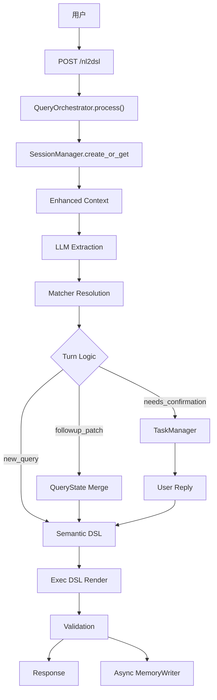
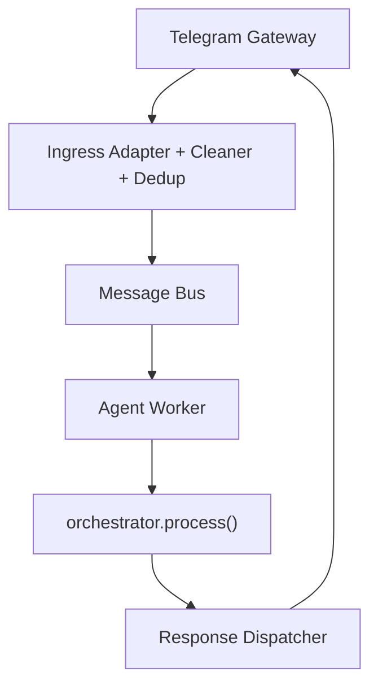
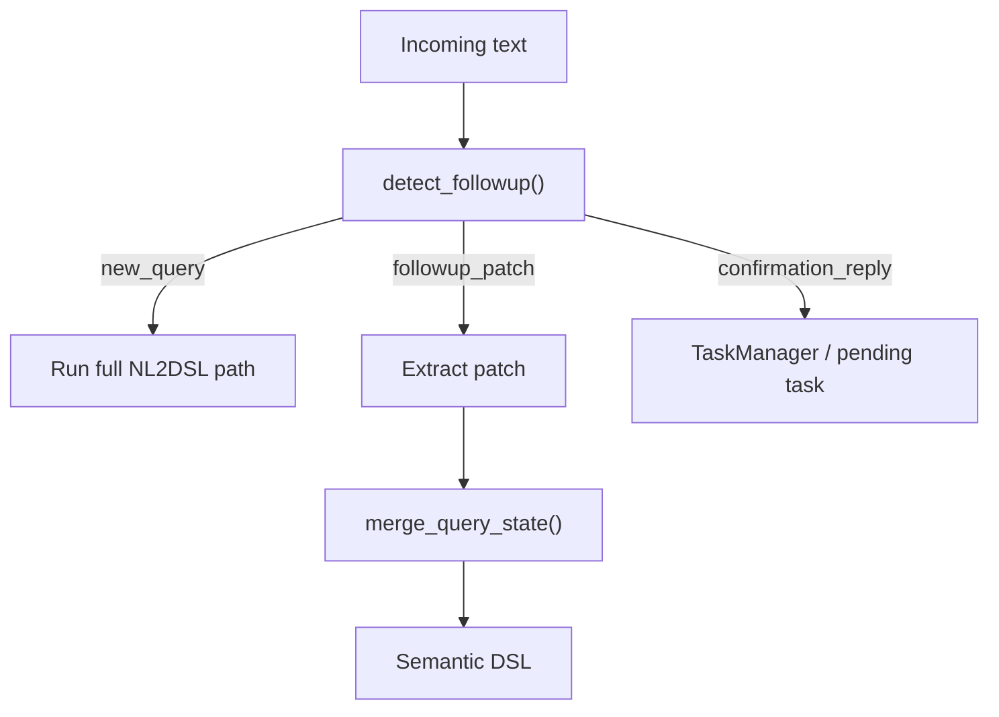
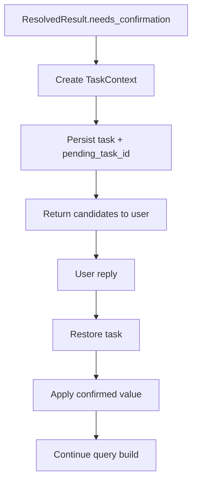

# 架构总览

[English](ARCHITECTURE.md) | [简体中文](ARCHITECTURE.zh-CN.md)

本文总结 `query-agent` 当前的真实架构、各主要模块的职责，以及层间依赖方向。

## 分层视图

```text
┌──────────────────────────────────────────────────────────────┐
│                        Gateway Layer                        │
│   TelegramGateway · HTTP Client / FastAPI Entry            │
├──────────────────────────────────────────────────────────────┤
│                          API Layer                          │
│   app.py                                                    │
│   端点定义 · 全局服务实例化 · 委托 QueryOrchestrator        │
├──────────────────────────────────────────────────────────────┤
│                       Turn / State Layer                    │
│   session_manager.py · session_models.py                    │
│   task_manager.py · followup_resolver.py                    │
│   query_state_merger.py                                     │
├──────────────────────────────────────────────────────────────┤
│                       NL2DSL Pipeline                       │
│   llm_extractions.py                                        │
│   matcher_service.py + matchers                             │
│   semantic_models.py · renderer.py · validators.py          │
├──────────────────────────────────────────────────────────────┤
│                        Memory Layer                         │
│   long_term_memory.py · memory_writer.py                    │
│   user_preference_store.py                                  │
├──────────────────────────────────────────────────────────────┤
│                    Runtime / System Layer                   │
│   bus/* · worker/* · dispatcher/* · server.py               │
└──────────────────────────────────────────────────────────────┘
```

## 依赖方向

核心规则：依赖应当自上而下流动。

```text
server.py
  ├─ gateway/*
  ├─ bus/*
  ├─ worker/*
  ├─ dispatcher/*
  └─ app.py
       └─ service/query_orchestrator.py
            ├─ service/session_manager.py
            ├─ service/task_manager.py
            ├─ service/followup_resolver.py
            ├─ service/query_state_merger.py
            ├─ service/llm_extractions.py
            ├─ matcher/*
            ├─ dsl/*
            └─ memory/*
```

设计约束：

- `app.py` 只负责端点定义和全局实例化，业务逻辑委托给 `QueryOrchestrator`
- `server.py` 负责启动 wiring 和生命周期，不负责查询语义
- `matcher/*` 聚焦匹配与召回，不掺入 session 策略
- `memory/*` 提供可复用知识层和偏好信号，不直接耦合 FastAPI 行为

## 顶层运行链路

### HTTP 路径



### Telegram / Bus 路径



## NL2DSL Pipeline

### Layer 1：LLM Extraction

主要文件：[service/llm_extractions.py](../service/llm_extractions.py)

职责：

- 把自然语言转成结构化 extraction
- 注入 session context 和选出的 project memory
- 在 follow-up 场景下尽量提取 patch，而不是重建全量状态

输入：

- `text`
- recent session context
- `last_query_state`
- selected `memory_corrections`

输出：

- `ExtractionsJson`

### Layer 2：Matcher Resolution

主要文件：[matcher/matcher_service.py](../matcher/matcher_service.py) 及具体 matcher。

职责：

- 解析 `metric / event / dimension / time`
- 返回 score、candidates、`needs_confirmation`
- 保持解析逻辑确定性、可解释

重要细节：

- user preference 只在 recall 后做小幅 rerank
- matcher 本身仍然是主要语义解析器

### Layer 3：Semantic DSL

主要文件：[dsl/semantic_models.py](../dsl/semantic_models.py)

职责：

- 表达规范化后的查询意图
- 将查询语义与下游执行格式解耦

### Layer 4：Exec DSL

主要文件：[dsl/renderer.py](../dsl/renderer.py) 和 [dsl/validators.py](../dsl/validators.py)

职责：

- 渲染执行 payload
- 校验 region 与一致性约束

## Turn-Based Querying

Turn-based 行为是系统的一等公民，不是简单的 prompt 技巧。

### 核心模块

- [service/session_models.py](../service/session_models.py)
  - `QueryState`
  - `SessionContext`
  - `TaskContext`
- [service/followup_resolver.py](../service/followup_resolver.py)
- [service/query_state_merger.py](../service/query_state_merger.py)
- [service/task_manager.py](../service/task_manager.py)

### Turn 模式

系统区分：

- `new_query`
- `followup_patch`
- `confirmation`

### Follow-Up 流程



### 为什么重要

它能支持这类多轮查询：

```text
Q1: 德国 app_launch 的 PV
Q2: 昨天
Q3: 改成 UV
Q4: 再按渠道拆一下
Q5: 那美国呢
```

而不要求用户每轮都把所有字段重说一遍。

## Memory 架构

当前项目实际上已经形成了三层 memory。

### 1. Session Memory

主要文件：

- [service/session_manager.py](../service/session_manager.py)
- [service/session_models.py](../service/session_models.py)

存储内容：

- `last_query_state`
- `pending_task_id`
- recent messages
- turn metadata

作用：

- follow-up patch
- confirmation continuation
- session restart recovery

### 2. Project Memory

主要文件：[memory/long_term_memory.py](../memory/long_term_memory.py)

存储内容：

- 项目级 corrections
- 业务约束
- 默认映射
- 领域 caveats

重要细节：

- memory 从 `project_{id}/MEMORY.md` 加载
- 会结合当前 query text 选择更相关的 memory 片段
- 不再需要每轮都注入整份项目 memory

### 3. User Preference Signal

主要文件：[memory/user_preference_store.py](../memory/user_preference_store.py)

存储内容：

- 用户级 `event / metric / group_by` 使用计数
- 作用域严格限制为 `project_id + user_id`

作用：

- 在 recall 后对 top candidates 做 rerank
- 绝不替代 matcher 主语义判断
- 保持为弱信号，而不是主解析器

## Confirmation Flow

低置信度歧义通过显式确认处理，而不是 silent guessing。

### Confirmation 生命周期



### 持久化

Session 和 Task 分开持久化：

- session：JSONL append-only session log
- task：JSONL append-only task log
- JSONL compaction：超过 500 行自动压缩，保留 100 条 + 最新 state/meta

这样可以支持：

- 进程重启恢复
- 聊天渠道里的延迟确认
- 长期运行不撑爆磁盘

## Async Memory Learning

主要文件：[memory/memory_writer.py](../memory/memory_writer.py)

职责：

- 异步判断某次成功查询是否值得沉淀为长期记忆
- 将学习结果追加到项目级 memory 文件
- 自动维护 `MEMORY.md` 索引

它是一个 sidecar 行为：

- 非阻塞
- 容错
- 不影响主查询路径

## 系统组件

### `app.py`

职责：

- request/response models
- 全局服务实例化（SessionManager、TaskManager、QueryOrchestrator）
- 端点定义（委托给 QueryOrchestrator）
- Telegram 通知辅助

### `server.py`

职责：

- 应用生命周期
- matcher service 初始化
- bus / worker / dispatcher 装配
- Telegram gateway 启动
- catalog scheduler 启动
- session 定时清理（5 分钟间隔，60 分钟过期）

### `gateway/*`, `ingress/*`, `bus/*`, `worker/*`, `dispatcher/*`

职责：

- 渠道适配
- 文本清洗与去重
- 异步请求传输
- worker 消费
- 响应路由

这些组件让系统不只是一个 HTTP API，而是可以作为消息驱动 agent 运行。

## 架构场景示例

下面这些场景适合用来从端到端角度验证架构是否闭环。它们更偏行为说明，
不是单个函数的 unit test。

### 场景 1：首次查询

```json
POST /nl2dsl
{
  "text": "德国 app_launch 的 PV",
  "project_id": 55
}
```

预期行为：

- 创建或恢复 session
- 走完整 `new_query` 路径
- 解析 event、metric、time、region
- 返回 `status=success`
- 持久化 `last_query_state`，供后续 turn 使用

### 场景 2：Follow-Up Patch

```json
POST /nl2dsl
{
  "text": "换成 UV",
  "project_id": 55,
  "session_id": "abc-123"
}
```

预期行为：

- 识别为 `followup_patch`
- 继承 event、region 等未显式修改字段
- 只 patch metric 字段
- 在 `field_sources` 中标记字段来源是 `explicit` 还是 `inherited`

### 场景 3：纯时间 Follow-Up

```text
Q1: 德国 app_launch 的 PV
Q2: 昨天
```

预期行为：

- 保持 `event=app_launch`
- 保持 `metric=pv`
- 保持上一轮 region
- 只修改 time range

这也是为什么 `last_query_state` 必须是结构化状态，而不能只是普通聊天摘要。

### 场景 4：确认流

```json
POST /nl2dsl
{
  "text": "看启动成功",
  "project_id": 55
}
```

如果 event 解析存在歧义，系统应返回：

```json
{
  "status": "needs_confirmation",
  "task_id": "xxx",
  "candidates": {
    "event": [
      { "value": "app_launch", "score": 72.0 },
      { "value": "app_cold_start_success", "score": 69.0 }
    ]
  }
}
```

随后用户回复：

```json
POST /nl2dsl
{
  "text": "1",
  "session_id": "abc-123"
}
```

系统应恢复 pending task，应用用户确认的候选值，继续生成 DSL，并清理
`pending_task_id`。

### 场景 5：Project Memory 注入

```text
Project memory:
在 project_55 中，activation 默认指 activation_success。

User query:
昨天 activation 的 PV
```

预期行为：

- 只加载 `_global` 和 `project_55` 作用域的 memory
- 选择与当前 query 相关的 project memory 片段
- 在 LLM extraction 前注入这些片段
- 将项目规则和用户偏好明确区分

### 场景 6：User Preference Rerank

```text
User history:
user_a 在 project_55 中经常选择 payment_submit。

Current query:
看 payment event 的 PV。
```

预期行为：

- matcher recall 仍然先产生候选集
- user preference 只在 recall 后生效
- preference 可以轻微提升 `payment_submit`
- preference 不能覆盖更强的显式语义匹配

### 场景 7：重启恢复

```text
Turn 1: 模糊查询返回 needs_confirmation
Process restarts
Turn 2: 用户回复 "1"
```

预期行为：

- session storage 恢复 `pending_task_id`
- task storage 恢复未完成的确认任务
- 用户确认回复继续完成查询，而不是被当作新的独立查询

## Validation 与 Debugging

系统当前暴露了比较丰富的 explain / debug 信息：

- `resolver_explain`
- `turn_explain`
- candidate scores
- follow-up decision signals
- patch fields
- confirmed fields
- 各层 timing

这很重要，因为项目已经更像 agent，而不是一次性翻译器。

## Evaluation 策略

项目同时使用常规测试和数据驱动 end-to-end eval。

### End-to-End Eval Harness

主要文件：

- [tests/evals/nl2dsl_cases.yaml](../tests/evals/nl2dsl_cases.yaml)
- [tests/test_end_to_end_evals.py](../tests/test_end_to_end_evals.py)

当前覆盖包括：

- basic new query
- follow-up patch
- follow-up + confirmation
- project memory injection
- restart + confirmation recovery

这套 harness 更接近“golden cases”，而不是单纯 unit test。

## Catalog 与 Metadata

仓库里的 YAML catalog 主要是 demo/development 态输入。

更接近生产的方向是：

- metadata 从 HTTP 源获取
- 同步到本地 catalog
- matcher indexes 在刷新后重建

这一点重要，因为真实环境可能会有：

- 数万级 event
- 每个 event 多个 dimension/property
- 强项目语义和业务约束

## 演进路线

之前的架构草稿把当前行为和未来优化方案混在了一起。其中有价值的方向保留在这里；
本文件继续作为当前真实架构的主要说明。

### User History Layer

未来生产版本可以增加独立的 `UserHistoryService`，负责：

- query history
- user aliases
- user preferences
- user patterns

推荐的存储分工是：

- PostgreSQL：持久化 query history、user aliases、preference records
- Redis：缓存热点 user context 和 preference
- 可选 Vector DB：用于 semantic memory retrieval、few-shot selection、ambiguous-rule recall

### User Context 应该在哪里生效

用户历史不能替代 resolver，只能在受控位置发挥作用：

- LLM extraction 前：注入选出的 alias、default、personalized few-shot examples
- matcher recall 后：用 user pattern 做弱 rerank bias
- 查询成功后：异步保存 query history，并更新聚合 pattern

### 未来数据模型

比较自然的未来模型包括：

- `UserPreferences`：默认 metric、region、event、time range
- `UserAlias`：用户自定义表达与标准 event / metric / dimension 的映射
- `UserPattern`：聚合后的 top events、metrics、regions、dimensions、query frequency
- `QueryHistory`：成功和失败 query trace，用于 replay、learning、evaluation

### 重要约束

个性化必须明确限制作用域：

```text
project_id + user_id
```

优先级仍应保持为：

```text
explicit user input
  > session state
  > project memory
  > user history / preference signals
```

这样可以避免历史行为静默覆盖当前更清晰的查询，或者覆盖项目级业务规则。
