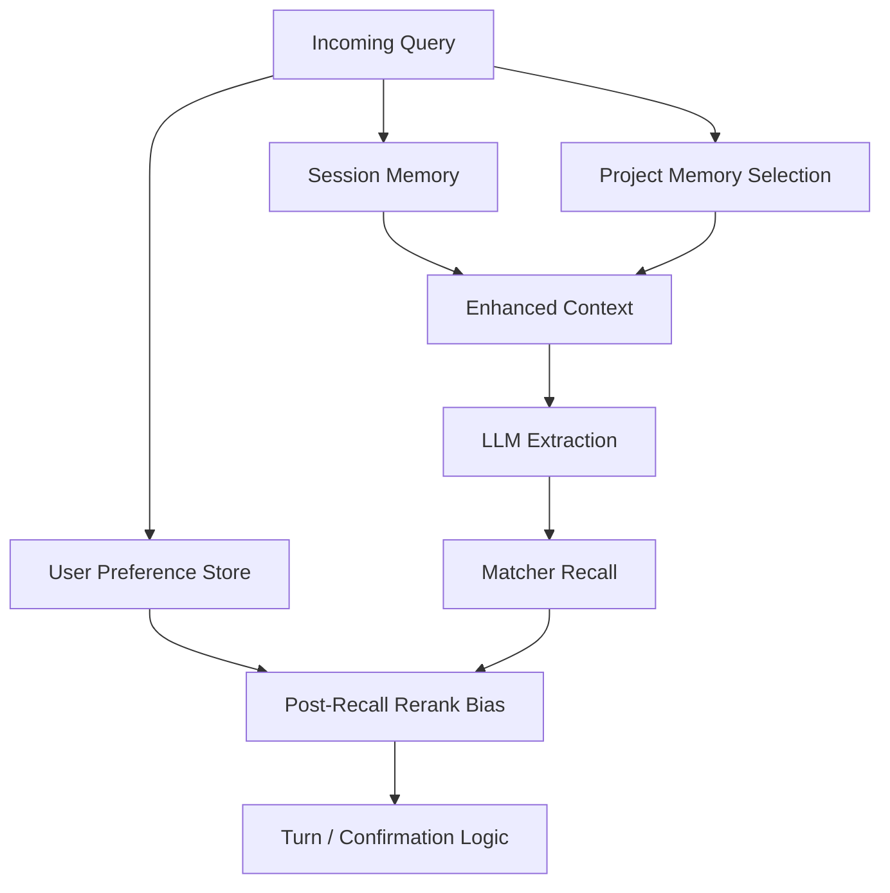

# Memory Architecture

[English](MEMORY.md) | [Chinese](MEMORY.zh-CN.md)

This document explains the memory design in `query-agent`, why the project needs more than one kind of memory, and how the current implementation maps to that model.

## Why “Memory” Is Not One Thing Here

For a data query agent, “memory” is not just chat history.

Different kinds of knowledge have different:

- scope
- lifetime
- trust level
- usage point in the pipeline

If these are mixed together, the system becomes less reliable:

- short-lived turn state may leak across sessions
- user-specific habits may pollute other users
- project-wide business rules may be mistaken for user preference

That is why this project should not stop at “session memory + user memory”.

The more natural split is:

- Session Memory
- Project Memory
- User Preference Signal

## Layer 1: Session Memory

### What It Stores

Session memory stores the short-lived state of the current conversation:

- `last_query_state`
- `pending_task_id`
- recent messages
- turn type metadata

### Where It Lives

- [service/session_models.py](../service/session_models.py)
- [service/session_manager.py](../service/session_manager.py)
- [service/task_manager.py](../service/task_manager.py)

### Why It Exists

It solves turn-based continuity:

```text
Q1: Show PV for app_launch in Germany
Q2: Yesterday
Q3: Change it to UV
```

Without session memory, the agent would have to re-infer all fields every turn.

### Characteristics

- scope: current session
- lifetime: short
- trust level: high
- usage point: before / during turn resolution

## Layer 2: Project Memory

### What It Stores

Project memory stores project-scoped business knowledge:

- default event mappings
- business constraints
- domain corrections
- dimension/property caveats
- project-specific interpretation rules

Examples:

- "In project_55, activation should map to activation_success by default"
- "In this project, country should prefer profile.country"
- "Some query types should exclude internal traffic by default"

### Where It Lives

- [memory/long_term_memory.py](../memory/long_term_memory.py)
- runtime files under `data/memory/project_{id}/`

### Why It Exists

This knowledge is:

- not temporary like session state
- not personal like user habit
- but essential for correct query interpretation

This is especially important when real metadata is large, for example:

- ~40K events
- many properties per event
- overlapping natural-language expressions

In that environment, project semantics matter as much as raw matching.

### Current Implementation Detail

Project memory is loaded from `project_{id}/MEMORY.md`.

The current implementation also does lightweight relevance selection:

- use current query text
- optionally use fields from `last_query_state`
- select a few more relevant memory fragments
- avoid injecting every memory entry every turn

### Characteristics

- scope: project
- lifetime: long
- trust level: high
- usage point: prompt/context injection before extraction

## Layer 3: User Preference Signal

### What It Stores

User preference stores lightweight usage patterns such as:

- frequent events
- frequent metrics
- frequent group-by dimensions

Examples:

- user A often checks `payment_submit`
- user A usually prefers `uv`
- user A often groups by `channel`

### Where It Lives

- [memory/user_preference_store.py](../memory/user_preference_store.py)
- runtime files under `data/user_preferences/`

### Why It Exists

Preference can improve ranking when multiple candidates are plausible.

But this is not the same as true project/business semantics.

### Very Important Constraint

User preference is intentionally implemented as:

- post-recall rerank signal

not as:

- primary resolver
- hard override

That means:

1. matcher still performs the main semantic recall
2. preference only biases the top candidates
3. scope is restricted to `project_id + user_id`

This prevents overfitting to the user’s history.

### Characteristics

- scope: project + user
- lifetime: medium to long
- trust level: medium
- usage point: after recall, before final candidate choice

## Why User Preference Should Not Replace Matching

Consider:

```text
User history: often checks payment_success
Current query: Show registration completion
```

If preference is too strong, the system may drift toward payment-related events.

That is why user preference must stay a weak signal.

Good use:

- rerank top-k candidates

Bad use:

- globally bias every query before recall
- overwrite a stronger semantic match

## Why Project Memory Is Different From User Preference

Consider this rule:

```text
In project_55, activation should mean activation_success by default
```

This is not:

- a temporary session fact
- a personal user habit

It applies to everyone querying that project.

So it belongs in project memory, not user preference.

This is the key reason the architecture needs at least 3 memory categories, not 2.

## Current Priority Order

The intended priority order in the project is:

```text
explicit user input
  > session state
  > project memory
  > user preference rerank
```

Interpretation:

- explicit input is strongest
- session state fills omitted fields
- project memory constrains interpretation
- user preference only nudges ranking

## Current Runtime Flow



## What Is Already Implemented

Implemented now:

- session persistence and recovery
- `last_query_state`
- `pending_task_id`
- project memory loading from `MEMORY.md`
- relevant project memory snippet selection
- user preference usage counts
- user preference rerank scoped by `project_id + user_id`

Not fully implemented yet:

- richer `UserAlias`
- richer `UserPattern`
- richer `UserPreferences`
- durable `QueryHistory`
- explicit category-aware memory retrieval (`constraint > correction > preference`)
- cross-session user memory beyond simple preference counts

## Why Short-Term QueryState Does Not Need AI Summarization

Short-term query state is already structured.

Example:

```json
{
  "event": "app_launch",
  "metric": "pv",
  "time_range": {"type": "last_n_days", "n": 7},
  "region_filter": ["ROW"],
  "group_by": ["country"]
}
```

This is already more precise than a text summary.

So AI summarization is usually unnecessary for session memory.

## Where AI-Like Selection May Still Help Later

Long-term memory is different:

- many project rules
- corrections
- learned preferences
- caveats

As this grows, the system may need smarter selection for:

- memory snippet choice
- few-shot example choice
- ambiguous explanation generation

So “AI retrieval/summarization is unnecessary” is only true for short-term structured turn state, not for every memory problem in the project.

## Recommended Next Steps

1. Add category-aware project memory retrieval
2. Introduce `UserAlias`, `UserPattern`, and `UserPreferences` separately from raw counts
3. Add durable `QueryHistory` for replay, pattern aggregation, and failure analysis
4. Consider a hybrid Markdown + embedding index for long-term project memory retrieval
5. Expand eval cases for project memory and user preference behavior
6. Add conflict-resolution policy when project memory and user preference disagree

## User Memory Evolution

The future user memory layer should be more structured than today's lightweight
usage counters.

Recommended split:

- `UserAlias`: explicit or learned aliases such as “startup” -> `app_launch`
- `UserPattern`: aggregated top events, metrics, dimensions, regions, and query frequency
- `UserPreferences`: stable defaults such as preferred metric, region, or time range
- `QueryHistory`: durable query traces for replay, evaluation, and pattern learning

Recommended storage:

- PostgreSQL for durable user records and query history
- Redis for hot per-user/project context
- optional vector database for semantic recall over long-term memory and examples

Even with these additions, user memory should remain weaker than explicit input,
session state, and project memory.
