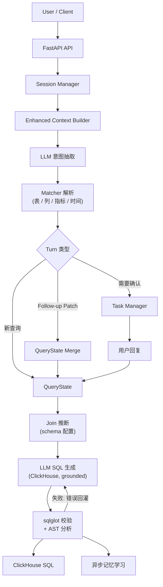

# Query Agent

[English](../README.md) | [简体中文](README.zh-CN.md)

`query-agent` 是一个面向 ClickHouse 的 **NL2SQL Data Agent**。它接收自然语言问题，抽取查询意图片段（`table / metric / column / filter / time / group_by / order / window`），用确定性 matcher 把片段解析为 schema 规范实体，并生成经过校验的 ClickHouse SQL——同时支持多轮会话、歧义实体的确认流、项目记忆和用户偏好重排。

这个项目不是一个普通的 text2sql demo，而是一个受控的 Data Agent：

- 支持 HTTP 和 Telegram 两种入口
- 支持 turn-based follow-up 和 confirmation
- 支持 Session Memory、Project Memory、User Preference Signal
- 支持 Direct / Redis 两种消息总线模式
- 支持 end-to-end eval 样例集

## 总览

核心查询链路：

```text
Natural Language
  -> LLM 意图抽取 (Layer 1)
  -> 确定性实体解析 (Layer 2: 表 / 列 / 指标 / 时间)
  -> QueryState / Turn 逻辑
  -> 基于已解析实体的 LLM SQL 生成 (Layer 3)
  -> sqlglot 校验 (只读 / 表白名单 / 自动 LIMIT)
  -> ClickHouse SQL
```

系统运行链路：

```text
Gateway
  -> Ingress
  -> Message Bus
  -> Agent Worker
  -> NL2SQL Pipeline
  -> Dispatcher
```

## 核心亮点

- **确定性实体解析**：表/列/指标名由 IDF 加权倒排召回（判别性 token 主导）+ edit-distance typo 探测 + RapidFuzz 重排对 schema 目录解析（带分数与候选），LLM 从不发明实体名
- **确认流即护栏**：低置信实体触发显式用户确认而非静默猜测——阈值按实体类型校准（metric 更严：auto-accept 90 分，因为指标错则数字全错），并列守卫在 top1/top2 分差 <10 时即使过线也进确认；join 路径缺失同样升级确认
- **Join 由 schema 配置**：join 关系来自元数据，不由 LLM 猜测
- **Turn-based 多轮**：`last_query_state` + follow-up 检测 + 字段级 patch merge（状态机，不是聊天回放）
- **接地（grounded）的 SQL 生成**：生成 prompt 固定已解析的表/列/指标名、join 条件与时间谓词，LLM 只组装查询结构
- **sqlglot 校验**：单条只读语句、表白名单、默认 LIMIT 注入，失败带错误信息修复重试（上限 2 轮）
- **AST 后置分析**（`sql_ast_analyzer.py`）：列存在性（别名解析）、实体保真断言（已解析的表/指标表达式/过滤谓词必须出现在 SQL 中，对抗语义漂移）、join 边与 join 键与 schema 声明一致性、静态成本分析（est_rows 扫描量估算、事实表全表扫描检测）——分析错误同样回灌修复循环
- **Cross-encoder 重排**（`reranker.py`，`RERANKER_ENABLED=true`）：歧义匹配（确认带或候选并列）时的受限 LLM 终选——只能从已有候选中选、不得发明新值；明确胜出（relevance≥85 且 margin≥15）则静默采纳，否则确认流照常但候选更优排序；生产可替换为本地 bge-reranker 模型
- 会话持久化（JSONL append-only，重启恢复）与待确认任务持久化（幂等确认）
- 异步记忆学习：成功查询可回写纠正/偏好/约束记忆
- 端到端 eval：45 条 golden case（mock 版 pytest + 真实 LLM 的 live eval）

## 示例会话

```text
Q1: Revenue by region for the last 7 days
-> SELECT users.region AS region, sum(orders.amount) AS revenue
   FROM orders JOIN users ON orders.user_id = users.id
   WHERE orders.created_at >= now() - INTERVAL 7 DAY
   GROUP BY users.region ORDER BY revenue DESC LIMIT 100

Q2: only gold members, top 3 per region
-> patch: filters += [users.vip_level = 'gold'], window = {users.region, top 3}
-> SELECT users.region, sum(orders.amount) AS revenue
   FROM orders JOIN users ON orders.user_id = users.id
   WHERE users.vip_level = 'gold' AND orders.created_at >= now() - INTERVAL 7 DAY
   GROUP BY users.region ORDER BY revenue DESC LIMIT 3 BY users.region
```

Q2 继承了 Q1 的指标/时间/分组——每轮只抽取和合并变化的部分。demo schema 只有英文别名，所以示例查询用英文。`LIMIT 3 BY` 是 ClickHouse 的分组内排名语法。

## 关键概念

### 1. 分层生成

- **Layer 1（LLM 抽取）** 只切分意图片段——从不给出表名或列名
- **Layer 2（matcher）** 把片段解析为规范 `table` / `table.column` / `metric_id`（带分数）：auto-accept 阈值按类型校准（metric 90 / table·column 80），确认带内触发用户确认，top1/top2 分差 <10 并列时即使过线也确认，< 40 丢弃或回退；召回为 IDF 加权（BM25-lite）并对零命中 token 做 edit-distance-1 探测；跨实体同名别名冲突绝不静默 first-wins——有基表上下文时按 join 距离消歧，否则进确认流。用户不提表名时从指标归属表或列归属投票推断主表
- **Layer 3（SQL 生成）** 是一次"接地"的 LLM 调用：prompt 固定表名、列名、指标表达式、join 条件和时间谓词，LLM 只组装结构（GROUP BY / JOIN / 用 `LIMIT n BY` 做分组排名）
- **校验**（sqlglot，`dialect="clickhouse"`）强制单条只读语句、表白名单、默认 LIMIT；失败带错误反馈修复

### 2. Turn-Based 多轮查询

```text
Q1: Revenue by region for the last 7 days   （新查询）
Q2: Yesterday                               （patch time_range）
Q3: Change it to order count                （patch metrics）
Q4: Break it down by category               （patch group_by）
Q5: What about the products table?          （patch tables）
Q6: Top 3 per region                        （patch window）
```

turn 判定是纯规则（`followup_resolver`），状态合并是字段级（`query_state_merger`，带 explicit/inherited 溯源），每轮可通过 `turn_explain` 完整解释。

### 3. 三层记忆

- `Session Memory` — `last_query_state / pending_task / recent turns`，JSONL 持久化，重启可恢复
- `Project Memory` — 项目级纠正/约束（`project_{id}/MEMORY.md`），按关键词选取注入抽取 prompt
- `User Preference Signal` — `project_id + user_id` 维度的表/指标/列使用计数，仅作为 recall 后的弱 rerank 信号

## 快速开始

### 安装

```bash
pip install -r requirements.txt
```

### 配置

```bash
cp .env.example .env
```

常用环境变量：

| Variable | Required | Default | Description |
|---|---|---|---|
| `PORT` | No | `8000` | HTTP 端口 |
| `LOG_LEVEL` | No | `DEBUG` | 日志级别 |
| `LLM_BACKEND` | No | `zhipu` | `zhipu` 或 `ollama` |
| `ZHIPU_MODEL` | No | `glm-4` | 抽取 + SQL 生成模型 |
| `TOOL_CALLING_ENABLED` | No | `true` | `false` 强制走 prompt-based JSON 输出 |
| `RERANKER_ENABLED` | No | `false` | `true` 开启歧义匹配的 LLM cross-encoder 重排 |
| `TELEGRAM_BOT_TOKEN` | No | - | Telegram 入口 |
| `MESSAGE_BUS_BACKEND` | No | `direct` | `direct` 或 `redis` |

### 运行

```bash
python server.py
```

### 试一下

```bash
curl -X POST localhost:8000/nl2sql -H 'Content-Type: application/json' -d '{
  "text": "Revenue by region for the last 7 days",
  "project_id": 55
}'
```

响应字段：

- `extraction_json` — Layer 1 意图片段
- `sql` — 校验后的 ClickHouse SQL
- `resolved_intent` — 生成 SQL 所用的完整查询状态
- `explain` — `resolver_explain` / `turn_explain` / `sql_generation` / timing
- `session_id`、`status`、`message`、`task_id`、`candidates`

状态取值：

- `success`：SQL 已生成并通过校验
- `early_exit`：没有可用的查询信号（未提表/指标/过滤）
- `needs_confirmation`：低置信候选需要用户确认

`POST /nl2dsl` 保留为兼容别名。会话调试 API：`GET /sessions`、`GET /sessions/{id}`、`DELETE /sessions/{id}`。

## 架构总览



更完整的模块说明见 [ARCHITECTURE.zh-CN.md](ARCHITECTURE.zh-CN.md)。

## Schema 元数据与生产方向说明

表/列/指标元数据在 [catalog/sql_schema.yaml](../catalog/sql_schema.yaml)——本地演示样例（6 张表的电商 schema：`orders / users / products / payments / reviews / sellers`，声明式 join，指标口径如 `revenue = sum(orders.amount)`）。别名只有英文，demo 查询需要用英文提问。

本 Demo 刻意止步于 **NL → 校验后的 ClickHouse SQL**。以下生产扩展是文档化的方向，不在本 Demo 实现范围内：

1. **元数据来源** — `sql_schema.yaml` 是开发/演示态输入。生产态应从公司元数据服务（或 `INFORMATION_SCHEMA`）定时同步表/列/指标元数据，喂给 `load_sql_schema()` 热重建 matcher 索引
2. **查询执行** — 对真实 ClickHouse 执行 SQL（只读账号、语句超时、行数/成本上限、结果缓存）是下游步骤；当前 API 只返回 SQL
3. **结果渲染** — 查询结果的图表/表格渲染属于展示层
4. **治理加固** — 基于 user-scoped 谓词的行级安全、按用户限流、PII 脱敏、完整审计日志，是现有校验器之上的自然下一步

## 评测

两类测试：

- 单元 / 集成测试
- 数据驱动的端到端 eval：[tests/evals/nl2sql_cases.yaml](../tests/evals/nl2sql_cases.yaml) + [tests/test_end_to_end_evals.py](../tests/test_end_to_end_evals.py)

覆盖：45 条 golden case、9 组（单表、join、多跳 join、时间、过滤、歧义、window/TopN、follow-up、负例），已知缺口用 strict xfail 标记。详见 [EVALUATION.zh-CN.md](EVALUATION.zh-CN.md)。

eval harness mock 了 LLM 抽取与 SQL 生成，但跑真实的 matcher 服务、阈值逻辑、状态合并、确认流和持久化——golden case 锁定管道的确定性内核。

```bash
./.venv311/bin/pytest -q
```

另外 [scripts/live_eval.py](../scripts/live_eval.py) 用真实 LLM 重放同一批 case，度量 mock 测不到的抽取与 SQL 质量。

## 当前状态

主线能力：

- `NL -> 校验后 ClickHouse SQL` 管道（单表、schema 配置 join、`LIMIT n BY` 分组排名）
- 结构化状态合并的 turn-based 多轮
- 持久化、幂等的确认流
- 会话/任务持久化与重启恢复
- 项目记忆注入
- 用户偏好 rerank 信号
- 异步记忆学习
- 端到端 eval harness

下一步方向：

- 更丰富的 `UserPattern / UserAlias / Preferences`
- 元数据服务同步 + schema 热更新
- 查询执行层（带成本护栏的只读 ClickHouse runner）
- 基于真实 query log 扩大 golden eval 集
