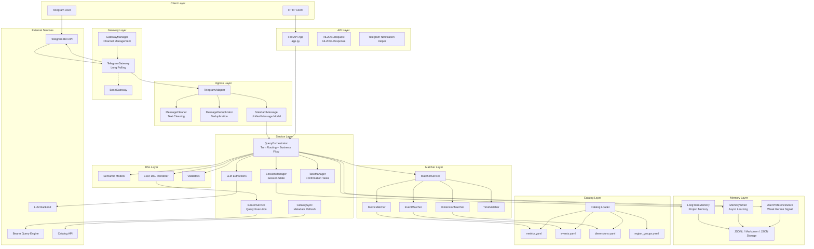

# Architecture Diagram

```mermaid
graph TB
    subgraph Client["Client Layer"]
        TelegramUser["Telegram User"]
        HttpClient["HTTP Client"]
    end

    subgraph Gateway["Gateway Layer"]
        TelegramGateway["TelegramGateway<br/>Long Polling"]
        GatewayManager["GatewayManager<br/>Channel Management"]
        BaseGateway["BaseGateway"]
    end

    subgraph Ingress["Ingress Layer"]
        TelegramAdapter["TelegramAdapter"]
        Cleaner["MessageCleaner<br/>Text Cleaning"]
        Dedup["MessageDeduplicator<br/>Deduplication"]
        StandardMessage["StandardMessage<br/>Unified Message Model"]
    end

    subgraph API["API Layer"]
        FastAPI["FastAPI App<br/>app.py"]
        Models["NL2DSLRequest<br/>NL2DSLResponse"]
        TelegramNotify["Telegram Notification Helper"]
    end

    subgraph Service["Service Layer"]
        Orchestrator["QueryOrchestrator<br/>Turn Routing + Business Flow"]
        LLM["LLM Extractions"]
        SessionManager["SessionManager<br/>Session State"]
        TaskManager["TaskManager<br/>Confirmation Tasks"]
        BearerService["BearerService<br/>Query Execution"]
        CatalogSync["CatalogSync<br/>Metadata Refresh"]
    end

    subgraph Memory["Memory Layer"]
        LongTermMemory["LongTermMemory<br/>Project Memory"]
        MemoryWriter["MemoryWriter<br/>Async Learning"]
        UserPreference["UserPreferenceStore<br/>Weak Rerank Signal"]
        Storage["JSONL / Markdown / JSON Storage"]
    end

    subgraph Matcher["Matcher Layer"]
        MatcherService["MatcherService"]
        EventMatcher["EventMatcher"]
        MetricMatcher["MetricMatcher"]
        DimensionMatcher["DimensionMatcher"]
        TimeMatcher["TimeMatcher"]
    end

    subgraph DSL["DSL Layer"]
        SemanticDSL["Semantic Models"]
        Renderer["Exec DSL Renderer"]
        Validators["Validators"]
    end

    subgraph Catalog["Catalog Layer"]
        Metrics["metrics.yaml"]
        Events["events.yaml"]
        Dimensions["dimensions.yaml"]
        Regions["region_groups.yaml"]
        CatalogLoader["Catalog Loader"]
    end

    subgraph External["External Services"]
        TelegramAPI["Telegram Bot API"]
        LLMBackend["LLM Backend"]
        BearerAPI["Bearer Query Engine"]
        CatalogAPI["Catalog API"]
    end

    TelegramUser --> TelegramAPI
    TelegramAPI --> TelegramGateway
    HttpClient --> FastAPI
    GatewayManager --> TelegramGateway
    TelegramGateway -.-> BaseGateway
    TelegramGateway --> TelegramAdapter
    TelegramAdapter --> Cleaner
    TelegramAdapter --> Dedup
    TelegramAdapter --> StandardMessage
    StandardMessage --> Orchestrator
    FastAPI --> Orchestrator

    Orchestrator --> SessionManager
    Orchestrator --> TaskManager
    Orchestrator --> LLM
    Orchestrator --> MatcherService
    Orchestrator --> SemanticDSL
    Orchestrator --> Renderer
    Orchestrator --> Validators
    Orchestrator --> MemoryWriter
    Orchestrator --> UserPreference

    SessionManager --> LongTermMemory
    LongTermMemory --> Storage
    MemoryWriter --> Storage
    UserPreference --> Storage

    MatcherService --> EventMatcher
    MatcherService --> MetricMatcher
    MatcherService --> DimensionMatcher
    MatcherService --> TimeMatcher
    EventMatcher --> Events
    MetricMatcher --> Metrics
    DimensionMatcher --> Dimensions
    CatalogLoader --> Metrics
    CatalogLoader --> Events
    CatalogLoader --> Dimensions
    CatalogLoader --> Regions

    LLM --> LLMBackend
    BearerService --> BearerAPI
    CatalogSync --> CatalogAPI
    Renderer --> BearerService
    TelegramGateway --> TelegramAPI
```
