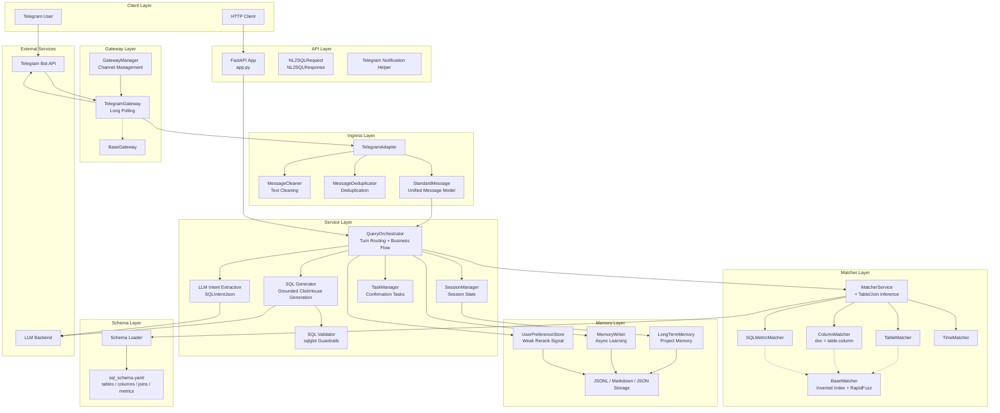

```mermaid
graph TB
    subgraph Client["Client Layer"]
        TelegramUser["Telegram User"]
        HttpClient["HTTP Client"]
    end

    subgraph Gateway["Gateway Layer"]
        TelegramGateway["TelegramGateway<br/>Long Polling"]
        GatewayManager["GatewayManager<br/>Channel Management"]
        BaseGateway["BaseGateway"]
    end

    subgraph Ingress["Ingress Layer"]
        TelegramAdapter["TelegramAdapter"]
        Cleaner["MessageCleaner<br/>Text Cleaning"]
        Dedup["MessageDeduplicator<br/>Deduplication"]
        StandardMessage["StandardMessage<br/>Unified Message Model"]
    end

    subgraph API["API Layer"]
        FastAPI["FastAPI App<br/>app.py"]
        Models["NL2SQLRequest<br/>NL2SQLResponse"]
        TelegramNotify["Telegram Notification Helper"]
    end

    subgraph Service["Service Layer"]
        Orchestrator["QueryOrchestrator<br/>Turn Routing + Business Flow"]
        LLM["LLM Intent Extraction<br/>SQLIntentJson"]
        SQLGen["SQL Generator<br/>Grounded ClickHouse Generation"]
        SQLVal["SQL Validator<br/>sqlglot Guardrails"]
        SessionManager["SessionManager<br/>Session State"]
        TaskManager["TaskManager<br/>Confirmation Tasks"]
    end

    subgraph Memory["Memory Layer"]
        LongTermMemory["LongTermMemory<br/>Project Memory"]
        MemoryWriter["MemoryWriter<br/>Async Learning"]
        UserPreference["UserPreferenceStore<br/>Weak Rerank Signal"]
        Storage["JSONL / Markdown / JSON Storage"]
    end

    subgraph Matcher["Matcher Layer"]
        MatcherService["MatcherService<br/>+ Table/Join Inference"]
        TableMatcher["TableMatcher"]
        ColumnMatcher["ColumnMatcher<br/>doc = table.column"]
        SQLMetricMatcher["SQLMetricMatcher"]
        TimeMatcher["TimeMatcher"]
        BaseMatcher["BaseMatcher<br/>Inverted Index + RapidFuzz"]
    end

    subgraph Schema["Schema Layer"]
        SchemaYaml["sql_schema.yaml<br/>tables / columns / joins / metrics"]
        SchemaLoader["Schema Loader"]
    end

    subgraph External["External Services"]
        TelegramAPI["Telegram Bot API"]
        LLMBackend["LLM Backend"]
    end

    TelegramUser --> TelegramAPI
    TelegramAPI --> TelegramGateway
    HttpClient --> FastAPI
    GatewayManager --> TelegramGateway
    TelegramGateway -.-> BaseGateway
    TelegramGateway --> TelegramAdapter
    TelegramAdapter --> Cleaner
    TelegramAdapter --> Dedup
    TelegramAdapter --> StandardMessage
    StandardMessage --> Orchestrator
    FastAPI --> Orchestrator

    Orchestrator --> SessionManager
    Orchestrator --> TaskManager
    Orchestrator --> LLM
    Orchestrator --> MatcherService
    Orchestrator --> SQLGen
    Orchestrator --> MemoryWriter
    Orchestrator --> UserPreference

    SessionManager --> LongTermMemory
    LongTermMemory --> Storage
    MemoryWriter --> Storage
    UserPreference --> Storage

    SQLGen --> SQLVal
    SQLGen --> LLMBackend
    LLM --> LLMBackend

    MatcherService --> TableMatcher
    MatcherService --> ColumnMatcher
    MatcherService --> SQLMetricMatcher
    MatcherService --> TimeMatcher
    TableMatcher -.-> BaseMatcher
    ColumnMatcher -.-> BaseMatcher
    SQLMetricMatcher -.-> BaseMatcher
    MatcherService --> SchemaLoader
    SchemaLoader --> SchemaYaml
    TelegramGateway --> TelegramAPI
```
