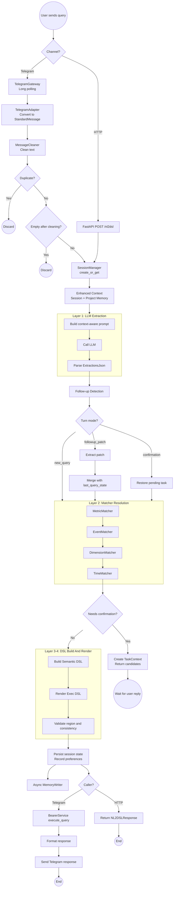

# End-To-End Flowchart

```mermaid
flowchart TD
    Start(("User sends query")) --> Channel{"Channel?"}

    Channel -->|Telegram| Poll["TelegramGateway<br/>Long polling"]
    Poll --> Adapt["TelegramAdapter<br/>Convert to StandardMessage"]
    Adapt --> Clean["MessageCleaner<br/>Clean text"]
    Clean --> Dup{"Duplicate?"}
    Dup -->|Yes| DropDup(("Discard"))
    Dup -->|No| Empty{"Empty after cleaning?"}
    Empty -->|Yes| DropEmpty(("Discard"))
    Empty -->|No| Session

    Channel -->|HTTP| HTTP["FastAPI POST /nl2dsl"]
    HTTP --> Session

    Session["SessionManager<br/>create_or_get"]
    Session --> Context["Enhanced Context<br/>Session + Project Memory"]
    Context --> Extract

    subgraph Extract["Layer 1: LLM Extraction"]
        Prompt["Build context-aware prompt"]
        LLM["Call LLM"]
        Parsed["Parse ExtractionsJson"]
        Prompt --> LLM --> Parsed
    end

    Parsed --> Followup["Follow-up Detection"]
    Followup --> Turn{"Turn mode?"}
    Turn -->|new_query| Resolve
    Turn -->|followup_patch| Patch["Extract patch"]
    Patch --> Merge["Merge with last_query_state"]
    Merge --> Resolve
    Turn -->|confirmation| Confirm["Restore pending task"]
    Confirm --> Resolve

    subgraph Resolve["Layer 2: Matcher Resolution"]
        Metric["MetricMatcher"]
        Event["EventMatcher"]
        Dimension["DimensionMatcher"]
        Time["TimeMatcher"]
        Metric --> Event --> Dimension --> Time
    end

    Time --> Ambiguous{"Needs confirmation?"}
    Ambiguous -->|Yes| Task["Create TaskContext<br/>Return candidates"]
    Task --> EndConfirm(("Wait for user reply"))
    Ambiguous -->|No| BuildDSL

    subgraph BuildDSL["Layer 3-4: DSL Build And Render"]
        Semantic["Build Semantic DSL"]
        Render["Render Exec DSL"]
        Validate["Validate region and consistency"]
        Semantic --> Render --> Validate
    end

    Validate --> Persist["Persist session state<br/>Record preferences"]
    Persist --> Learn["Async MemoryWriter"]
    Persist --> Caller{"Caller?"}
    Caller -->|Telegram| Execute["BearerService execute_query"]
    Execute --> Format["Format response"]
    Format --> Send["Send Telegram response"]
    Send --> EndTG(("End"))
    Caller -->|HTTP| Return["Return NL2DSLResponse"]
    Return --> EndHTTP(("End"))
```
