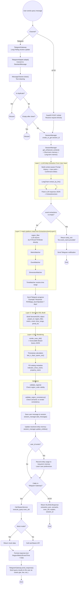

# 端到端流程图

[English](flowchart.md) | [简体中文](flowchart.zh-CN.md)

```mermaid
flowchart TD
    Start(("User sends query message")) --> Channel{"Channel?"}

    Channel -->|Telegram| TGPoll["TelegramGateway<br/>Long Polling receive update"]
    TGPoll --> Adapt["TelegramAdapter.adapt()<br/>Convert to StandardMessage"]
    Adapt --> Clean["MessageCleaner.clean()<br/>Text cleaning"]
    Clean --> DupCheck{"Is duplicate?"}
    DupCheck -->|Yes| StopDup(("Discard"))
    DupCheck -->|No| EmptyCheck{"Empty after clean?"}
    EmptyCheck -->|Yes| StopEmpty(("Discard"))
    EmptyCheck -->|No| CreateSession

    Channel -->|HTTP| DirectAPI["FastAPI POST /nl2dsl<br/>Receive request directly"]
    DirectAPI --> CreateSession

    CreateSession["SessionManager<br/>create_or_get session_id"]
    CreateSession --> GetCtx["SessionManager<br/>get_enhanced_context()<br/>= Short-term memory + Long-term memory"]

    GetCtx --> Layer1

    subgraph Layer1 ["Layer 1: LLM Entity Extraction From User Input"]
        BuildPrompt["Build context-aware Prompt<br/>History + User prefs + Confirmed entities"]
        BuildPrompt --> LangChain["LangChain extract_by_llm()"]
        LangChain --> ParseJSON["Parse LLM response JSON<br/>-> ExtractionsJson"]
        LangChain --> ParseJSON
    end

    ParseJSON --> EventCheck{"event extractions<br/>is empty?"}
    EventCheck -->|Yes| EarlyExit["Return early_exit<br/>'No event_name provided'"]
    EarlyExit --> TGNotify1["Send Telegram notification"]
    TGNotify1 --> Stop1(("End"))

    EventCheck -->|No| Layer2

    subgraph Layer2 ["Layer 2: match platform meta from ExtractionsJson(Layer1)"]
        ResolveRegion["region_filter<br/>LLM returns EUTTP/USTTP/ROW directly"]
        ResolveMetric["MetricMatcher"]
        ResolveEvent["EventMatcher"]
        ResolveDim["DimensionMatcher"]
        ResolveTime["TimeMatcher resolve time range"]
        ResolveRegion --> ResolveMetric --> ResolveEvent --> ResolveDim --> ResolveTime
    end

    ResolveTime --> TGNotify2["Send Telegram progress<br/>'Example: Resolved: ROW|app_launch|pv|last 7 days'"]

    subgraph Layer3 ["Layer 3: Semantic DSL Build"]
        BuildDSL["Build SemanticDSL object<br/>project_id, region_filter,<br/>metric, event, time_range, group_by"]
    end

    TGNotify2 --> BuildDSL

    subgraph Layer4 ["Layer 4: DSL Rendering"]
        RenderDSL["render_exec_dsl()<br/>-> Executable Bearer Query JSON"]
        CalcTime["Timestamp calculation<br/>last_n_days_spans_utc()"]
        FillMeta["Fill catalog metadata<br/>indicator_show_name, property_name"]
        RenderDSL --> CalcTime --> FillMeta
    end

    BuildDSL --> RenderDSL

    subgraph Validation ["Validation"]
        ValidateRegion["validate_region()<br/>Check region_code validity"]
        ValidateConsist["validate_region_consistency()<br/>Check semantic vs render consistency"]
        ValidateRegion --> ValidateConsist
    end

    FillMeta --> ValidateRegion

    ValidateConsist --> SaveMsg["Save user message to session<br/>session_manager.add_message()"]
    SaveMsg --> UpdateEntities["Update resolved entity memory<br/>session_manager.update_entities()"]
    UpdateEntities --> UserIDCheck{"user_id exists?"}
    UserIDCheck -->|Yes| LearnPrefs["Record entity usage to long-term memory<br/>Learn user preferences"]
    UserIDCheck -->|No| CallerCheck
    LearnPrefs --> CallerCheck

    CallerCheck{"Caller is<br/>Telegram Gateway?"}

    CallerCheck -->|Yes| ExecQuery["Call BearerService<br/>execute_query exec_dsl"]
    ExecQuery --> MockCheck{"Mock mode?"}
    MockCheck -->|Yes| MockData["Return mock data"]
    MockCheck -->|No| RealAPI["Call real Bearer API"]
    MockData --> FormatResp
    RealAPI --> FormatResp

    FormatResp["Format response text<br/>Region/Metric/Event/Time + Data"]
    FormatResp --> SendTG["TelegramGateway.send_response()<br/>Send query results to the user as charts (pie, line, etc.)."]
    SendTG --> Stop2(("End"))

    CallerCheck -->|HTTP| ReturnHTTP["Return NL2DSLResponse<br/>extraction_json, semantic,<br/>exec_dsl, explain, session_id"]
    ReturnHTTP --> Stop3(("End"))
```
