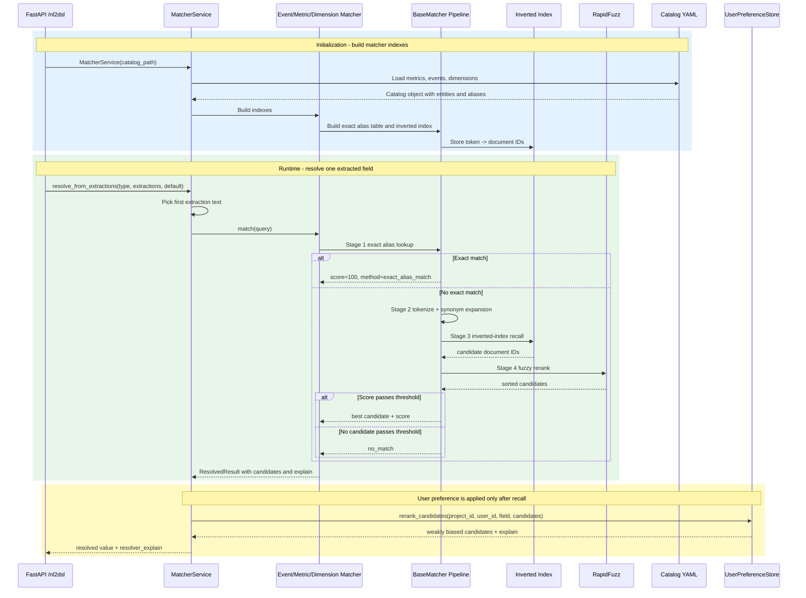

# Matcher Sequence

[English](matcher-sequence.md) | [Chinese](matcher-sequence.zh-CN.md)

```mermaid
sequenceDiagram
    participant API as FastAPI /nl2dsl
    participant MS as MatcherService
    participant Matcher as Event/Metric/Dimension Matcher
    participant Pipeline as BaseMatcher Pipeline
    participant Index as Inverted Index
    participant Fuzz as RapidFuzz
    participant Catalog as Catalog YAML
    participant Pref as UserPreferenceStore

    rect rgb(227, 242, 253)
    Note over API,Catalog: Initialization - build matcher indexes
    API->>MS: MatcherService(catalog_path)
    MS->>Catalog: Load metrics, events, dimensions
    Catalog-->>MS: Catalog object with entities and aliases
    MS->>Matcher: Build indexes
    Matcher->>Pipeline: Build exact alias table and inverted index
    Pipeline->>Index: Store token -> document IDs
    end

    rect rgb(232, 245, 233)
    Note over API,Fuzz: Runtime - resolve one extracted field
    API->>MS: resolve_from_extractions(type, extractions, default)
    MS->>MS: Pick first extraction text
    MS->>Matcher: match(query)
    Matcher->>Pipeline: Stage 1 exact alias lookup
    alt Exact match
        Pipeline-->>Matcher: score=100, method=exact_alias_match
    else No exact match
        Pipeline->>Pipeline: Stage 2 tokenize + synonym expansion
        Pipeline->>Index: Stage 3 inverted-index recall
        Index-->>Pipeline: candidate document IDs
        Pipeline->>Fuzz: Stage 4 fuzzy rerank
        Fuzz-->>Pipeline: sorted candidates
        alt Score passes threshold
            Pipeline-->>Matcher: best candidate + score
        else No candidate passes threshold
            Pipeline-->>Matcher: no_match
        end
    end
    Matcher-->>MS: ResolvedResult with candidates and explain
    end

    rect rgb(255, 249, 196)
    Note over MS,Pref: User preference is applied only after recall
    MS->>Pref: rerank_candidates(project_id, user_id, field, candidates)
    Pref-->>MS: weakly biased candidates + explain
    MS-->>API: resolved value + resolver_explain
    end
```
