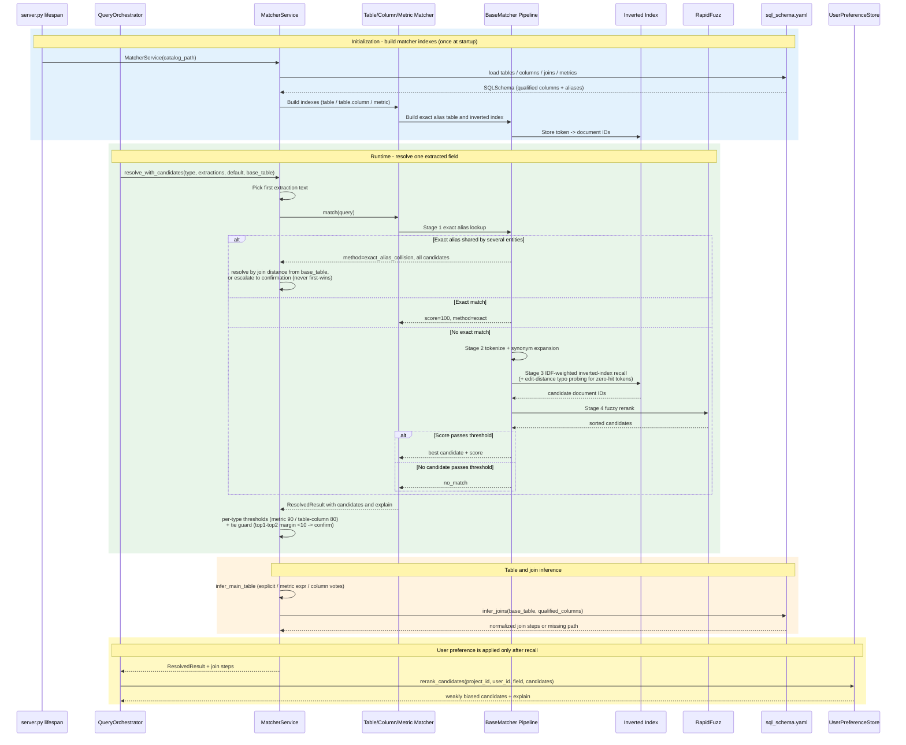

```mermaid
sequenceDiagram
    participant Server as server.py lifespan
    participant ORC as QueryOrchestrator
    participant MS as MatcherService
    participant Matcher as Table/Column/Metric Matcher
    participant Pipeline as BaseMatcher Pipeline
    participant Index as Inverted Index
    participant Fuzz as RapidFuzz
    participant Schema as sql_schema.yaml
    participant Pref as UserPreferenceStore

    rect rgb(227, 242, 253)
    Note over Server,Schema: Initialization - build matcher indexes (once at startup)
    Server->>MS: MatcherService(catalog_path)
    MS->>Schema: load tables / columns / joins / metrics
    Schema-->>MS: SQLSchema (qualified columns + aliases)
    MS->>Matcher: Build indexes (table / table.column / metric)
    Matcher->>Pipeline: Build exact alias table and inverted index
    Pipeline->>Index: Store token -> document IDs
    end

    rect rgb(232, 245, 233)
    Note over ORC,Fuzz: Runtime - resolve one extracted field
    ORC->>MS: resolve_with_candidates(type, extractions, default, base_table)
    MS->>MS: Pick first extraction text
    MS->>Matcher: match(query)
    Matcher->>Pipeline: Stage 1 exact alias lookup
    alt Exact alias shared by several entities
        Pipeline-->>MS: method=exact_alias_collision, all candidates
        MS->>MS: resolve by join distance from base_table,<br/>or escalate to confirmation (never first-wins)
    else Exact match
        Pipeline-->>Matcher: score=100, method=exact
    else No exact match
        Pipeline->>Pipeline: Stage 2 tokenize + synonym expansion
        Pipeline->>Index: Stage 3 IDF-weighted inverted-index recall<br/>(+ edit-distance typo probing for zero-hit tokens)
        Index-->>Pipeline: candidate document IDs
        Pipeline->>Fuzz: Stage 4 fuzzy rerank
        Fuzz-->>Pipeline: sorted candidates
        alt Score passes threshold
            Pipeline-->>Matcher: best candidate + score
        else No candidate passes threshold
            Pipeline-->>Matcher: no_match
        end
    end
    Matcher-->>MS: ResolvedResult with candidates and explain
    MS->>MS: per-type thresholds (metric 90 / table·column 80)<br/>+ tie guard (top1-top2 margin <10 -> confirm)
    end

    rect rgb(255, 243, 224)
    Note over MS,Schema: Table and join inference
    MS->>MS: infer_main_table (explicit / metric expr / column votes)
    MS->>Schema: infer_joins(base_table, qualified_columns)
    Schema-->>MS: normalized join steps or missing path
    end

    rect rgb(255, 249, 196)
    Note over ORC,Pref: User preference is applied only after recall
    MS-->>ORC: ResolvedResult + join steps
    ORC->>Pref: rerank_candidates(project_id, user_id, field, candidates)
    Pref-->>ORC: weakly biased candidates + explain
    end
```
