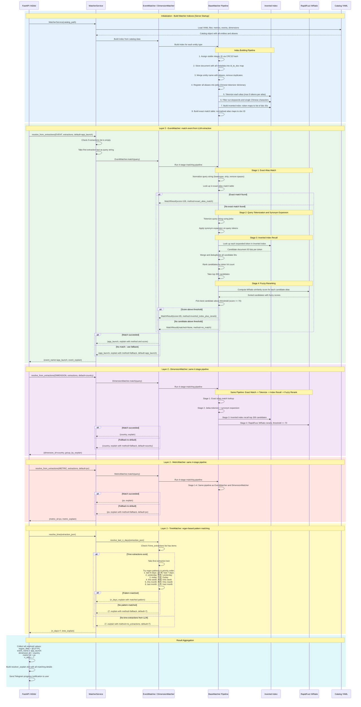

# Matcher 时序图

[English](matcher-sequence.md) | [简体中文](matcher-sequence.zh-CN.md)

```mermaid
%%{init: {'theme': 'default', 'themeVariables': {'fontSize': '20px', 'actorFontSize': '22px', 'participantFontSize': '20px', 'noteFontSize': '18px', 'sequenceNumberFontSize': '18px', 'messageFontSize': '20px'}}}%%
sequenceDiagram
    participant API as FastAPI /nl2dsl
    participant MS as MatcherService
    participant Matcher as EventMatcher / DimensionMatcher
    participant Pipeline as BaseMatcher Pipeline
    participant Index as Inverted Index
    participant Fuzz as RapidFuzz WRatio
    participant Catalog as Catalog YAML

    rect rgb(227, 242, 253)
    Note over API,Catalog: Initialization - Build Matcher Indexes (Server Startup)
    API->>MS: MatcherService(catalog_path)
    MS->>Catalog: Load YAML files: metrics, events, dimensions
    Catalog-->>MS: Catalog object with all entities and aliases

    MS->>Matcher: Build index from catalog data
    Matcher->>Pipeline: Build index for each entity type

    Note over Pipeline,Index: Index Building Pipeline
    Pipeline->>Pipeline: 1. Assign stable integer ID via CRC32 hash
    Pipeline->>Pipeline: 2. Store document with all metadata into id_to_doc map
    Pipeline->>Pipeline: 3. Merge entity name with aliases, remove duplicates
    Pipeline->>Pipeline: 4. Register all aliases into jieba Chinese tokenizer dictionary
    Pipeline->>Index: 5. Tokenize each alias (max 5 tokens per alias)
    Pipeline->>Index: 6. Filter out stopwords and single Chinese characters
    Pipeline->>Index: 7. Build inverted index: token maps to list of doc IDs
    Pipeline->>Pipeline: 8. Build exact match table: normalized alias maps to doc ID
    end

    rect rgb(232, 245, 233)
    Note over API,Catalog: Layer 2 - EventMatcher: match event from LLM extraction
    API->>MS: resolve_from_extractions(EVENT, extractions, default=app_launch)
    MS->>MS: Check if extractions list is empty
    MS->>MS: Take first extraction text as query string
    MS->>Matcher: EventMatcher.match(query)
    Matcher->>Pipeline: Run 4-stage matching pipeline

    Note over Pipeline,Fuzz: Stage 1: Exact Alias Match
    Pipeline->>Pipeline: Normalize query string (lowercase, strip, remove spaces)
    Pipeline->>Pipeline: Look up in exact alias match table
    alt Exact match found
        Pipeline-->>Matcher: MatchResult(score=100, method=exact_alias_match)
    else No exact match found
        Note over Pipeline,Fuzz: Stage 2: Query Tokenization and Synonym Expansion
        Pipeline->>Pipeline: Tokenize query string using jieba
        Pipeline->>Pipeline: Apply synonym expansion on query tokens

        Note over Pipeline,Fuzz: Stage 3: Inverted Index Recall
        Pipeline->>Index: Look up each expanded token in inverted index
        Index-->>Pipeline: Candidate document ID lists per token
        Pipeline->>Pipeline: Merge and deduplicate all candidate IDs
        Pipeline->>Pipeline: Rank candidates by token hit count
        Pipeline->>Pipeline: Take top 200 candidates

        Note over Pipeline,Fuzz: Stage 4: Fuzzy Reranking
        Pipeline->>Fuzz: Compute WRatio similarity score for each candidate alias
        Fuzz-->>Pipeline: Sorted candidates with fuzzy scores
        Pipeline->>Pipeline: Pick best candidate above threshold (score >= 70)
        alt Score above threshold
            Pipeline-->>Matcher: MatchResult(score=85, method=inverted_index_plus_rerank)
        else No candidate above threshold
            Pipeline-->>Matcher: MatchResult(matched=None, method=no_match)
        end
    end

    alt Match succeeded
        Matcher-->>MS: (app_launch, explain with method and score)
    else No match - use fallback
        Matcher-->>MS: (app_launch, explain with method=fallback, default=app_launch)
    end
    MS-->>API: (event_name=app_launch, event_explain)
    end

    rect rgb(243, 229, 245)
    Note over API,Catalog: Layer 2 - DimensionMatcher: same 4-stage pipeline
    API->>MS: resolve_from_extractions(DIMENSION, extractions, default=country)
    MS->>Matcher: DimensionMatcher.match(query)
    Matcher->>Pipeline: Run 4-stage matching pipeline

    Note over Pipeline,Fuzz: Same Pipeline: Exact Match -> Tokenize -> Index Recall -> Fuzzy Rerank
    Pipeline->>Pipeline: Stage 1: Exact alias match lookup
    Pipeline->>Pipeline: Stage 2: Jieba tokenize + synonym expansion
    Pipeline->>Index: Stage 3: Inverted index recall top 200 candidates
    Pipeline->>Fuzz: Stage 4: RapidFuzz WRatio rerank, threshold >= 70

    alt Match succeeded
        Matcher-->>MS: (country, explain)
    else Fallback to default
        Matcher-->>MS: (country, explain with method=fallback, default=country)
    end
    MS-->>API: (dimension_id=country, group_by_explain)
    end

    rect rgb(255, 229, 225)
    Note over API,Catalog: Layer 2 - MetricMatcher: same 4-stage pipeline
    API->>MS: resolve_from_extractions(METRIC, extractions, default=pv)
    MS->>Matcher: MetricMatcher.match(query)
    Matcher->>Pipeline: Run 4-stage matching pipeline
    Pipeline->>Pipeline: Stage 1-4: Same pipeline as EventMatcher and DimensionMatcher

    alt Match succeeded
        Matcher-->>MS: (pv, explain)
    else Fallback to default
        Matcher-->>MS: (pv, explain with method=fallback, default=pv)
    end
    MS-->>API: (metric_id=pv, metric_explain)
    end

    rect rgb(255, 249, 196)
    Note over API,Catalog: Layer 2 - TimeMatcher: regex-based pattern matching
    API->>MS: resolve_time(extraction_json)
    MS->>Matcher: resolve_last_n_days(extraction_json)

    Matcher->>Matcher: Check if time_extractions list has items
    alt Time extractions exist
        Matcher->>Matcher: Take first extraction text
        Matcher->>Matcher: Try regex patterns in priority order:<br/>1. last N days: 近7天 / last 7 days<br/>2. yesterday: 昨天 / yesterday<br/>3. today: 今天 / today<br/>4. this week: 本周 / this week<br/>5. this month: 本月 / this month<br/>6. last month: 上月 / last month
        alt Pattern matched
            Matcher-->>MS: (n_days, explain with matched pattern)
        else No pattern matched
            Matcher-->>MS: (7, explain with method=fallback, default=7)
        end
    else No time extractions from LLM
        Matcher-->>MS: (7, explain with method=no_extractions, default=7)
    end
    MS-->>API: (n_days=7, time_explain)
    end

    rect rgb(224, 247, 250)
    Note over API,Catalog: Result Aggregation
    API->>API: Collect all resolved values:<br/>region_filter = [EUTTP]<br/>event_name = app_launch<br/>dimension_id = country<br/>metric_id = pv<br/>n_days = 7
    API->>API: Build resolver_explain dict with all matching details
    API->>API: Send Telegram progress notification to user
    end
```
