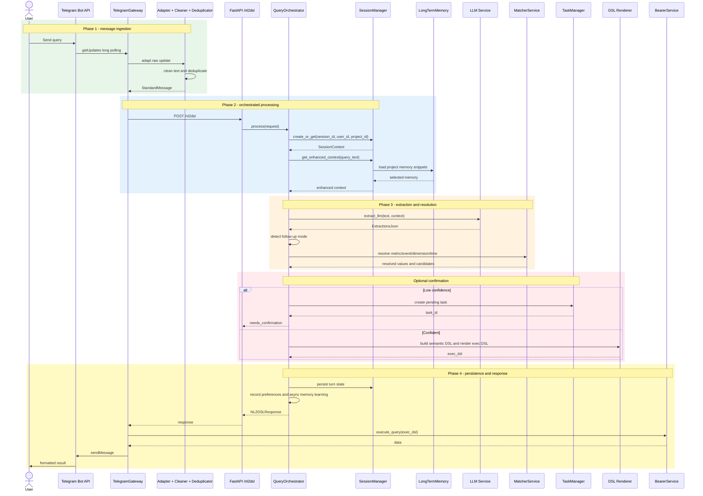

# Runtime Sequence

[English](sequence.md) | [Chinese](sequence.zh-CN.md)

```mermaid
sequenceDiagram
    actor User
    participant TgAPI as Telegram Bot API
    participant TGGw as TelegramGateway
    participant Ingress as Adapter + Cleaner + Deduplicator
    participant API as FastAPI /nl2dsl
    participant ORC as QueryOrchestrator
    participant Session as SessionManager
    participant Memory as LongTermMemory
    participant LLM as LLM Service
    participant Matcher as MatcherService
    participant Task as TaskManager
    participant DSL as DSL Renderer
    participant Bearer as BearerService

    rect rgb(232, 245, 233)
    Note over User,Ingress: Phase 1 - message ingestion
    User->>TgAPI: Send query
    TgAPI->>TGGw: getUpdates long polling
    TGGw->>Ingress: adapt raw update
    Ingress->>Ingress: clean text and deduplicate
    Ingress-->>TGGw: StandardMessage
    end

    rect rgb(227, 242, 253)
    Note over TGGw,Session: Phase 2 - orchestrated processing
    TGGw->>API: POST /nl2dsl
    API->>ORC: process(request)
    ORC->>Session: create_or_get(session_id, user_id, project_id)
    Session-->>ORC: SessionContext
    ORC->>Session: get_enhanced_context(query_text)
    Session->>Memory: load project memory snippets
    Memory-->>Session: selected memory
    Session-->>ORC: enhanced context
    end

    rect rgb(255, 243, 224)
    Note over ORC,Matcher: Phase 3 - extraction and resolution
    ORC->>LLM: extract_llm(text, context)
    LLM-->>ORC: ExtractionsJson
    ORC->>ORC: detect follow-up mode
    ORC->>Matcher: resolve metric/event/dimension/time
    Matcher-->>ORC: resolved values and candidates
    end

    rect rgb(255, 235, 238)
    Note over ORC,Task: Optional confirmation
    alt Low confidence
        ORC->>Task: create pending task
        Task-->>ORC: task_id
        ORC-->>API: needs_confirmation
    else Confident
        ORC->>DSL: build semantic DSL and render exec DSL
        DSL-->>ORC: exec_dsl
    end
    end

    rect rgb(255, 249, 196)
    Note over ORC,Bearer: Phase 4 - persistence and response
    ORC->>Session: persist turn state
    ORC->>ORC: record preferences and async memory learning
    ORC-->>API: NL2DSLResponse
    API-->>TGGw: response
    TGGw->>Bearer: execute_query(exec_dsl)
    Bearer-->>TGGw: data
    TGGw->>TgAPI: sendMessage
    TgAPI->>User: formatted result
    end
```
