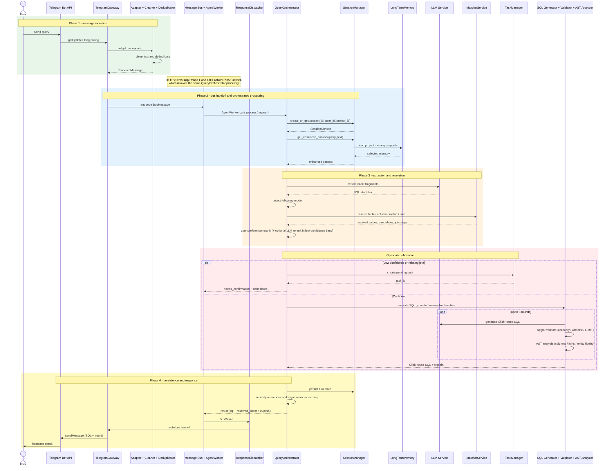

```mermaid
sequenceDiagram
    actor User
    participant TgAPI as Telegram Bot API
    participant TGGw as TelegramGateway
    participant Ingress as Adapter + Cleaner + Deduplicator
    participant Bus as Message Bus + AgentWorker
    participant Disp as ResponseDispatcher
    participant ORC as QueryOrchestrator
    participant Session as SessionManager
    participant Memory as LongTermMemory
    participant LLM as LLM Service
    participant Matcher as MatcherService
    participant Task as TaskManager
    participant SQLGen as SQL Generator + Validator + AST Analyzer

    rect rgb(232, 245, 233)
    Note over User,Ingress: Phase 1 - message ingestion
    User->>TgAPI: Send query
    TgAPI->>TGGw: getUpdates long polling
    TGGw->>Ingress: adapt raw update
    Ingress->>Ingress: clean text and deduplicate
    Ingress-->>TGGw: StandardMessage
    end
    Note over Bus: HTTP clients skip Phase 1 and call FastAPI POST /nl2sql,<br/>which invokes the same QueryOrchestrator.process()

    rect rgb(227, 242, 253)
    Note over TGGw,Session: Phase 2 - bus handoff and orchestrated processing
    TGGw->>Bus: enqueue BusMessage
    Bus->>ORC: AgentWorker calls process(request)
    ORC->>Session: create_or_get(session_id, user_id, project_id)
    Session-->>ORC: SessionContext
    ORC->>Session: get_enhanced_context(query_text)
    Session->>Memory: load project memory snippets
    Memory-->>Session: selected memory
    Session-->>ORC: enhanced context
    end

    rect rgb(255, 243, 224)
    Note over ORC,Matcher: Phase 3 - extraction and resolution
    ORC->>LLM: extract intent fragments
    LLM-->>ORC: SQLIntentJson
    ORC->>ORC: detect follow-up mode
    ORC->>Matcher: resolve table / column / metric / time
    Matcher-->>ORC: resolved values, candidates, join steps
    ORC->>ORC: user preference rerank (+ optional LLM rerank in low-confidence band)
    end

    rect rgb(255, 235, 238)
    Note over ORC,Task: Optional confirmation
    alt Low confidence or missing join
        ORC->>Task: create pending task
        Task-->>ORC: task_id
        ORC-->>Bus: needs_confirmation + candidates
    else Confident
        ORC->>SQLGen: generate SQL grounded on resolved entities
        loop up to 3 rounds
            SQLGen->>LLM: generate ClickHouse SQL
            SQLGen->>SQLGen: sqlglot validate (readonly / whitelist / LIMIT)
            SQLGen->>SQLGen: AST analysis (columns / joins / entity fidelity)
        end
        SQLGen-->>ORC: ClickHouse SQL + explain
    end
    end

    rect rgb(255, 249, 196)
    Note over ORC,TgAPI: Phase 4 - persistence and response
    ORC->>Session: persist turn state
    ORC->>ORC: record preferences and async memory learning
    ORC-->>Bus: result (sql + resolved_intent + explain)
    Bus->>Disp: BusResult
    Disp->>TGGw: route by channel
    TGGw->>TgAPI: sendMessage (SQL + intent)
    TgAPI->>User: formatted result
    end
```
