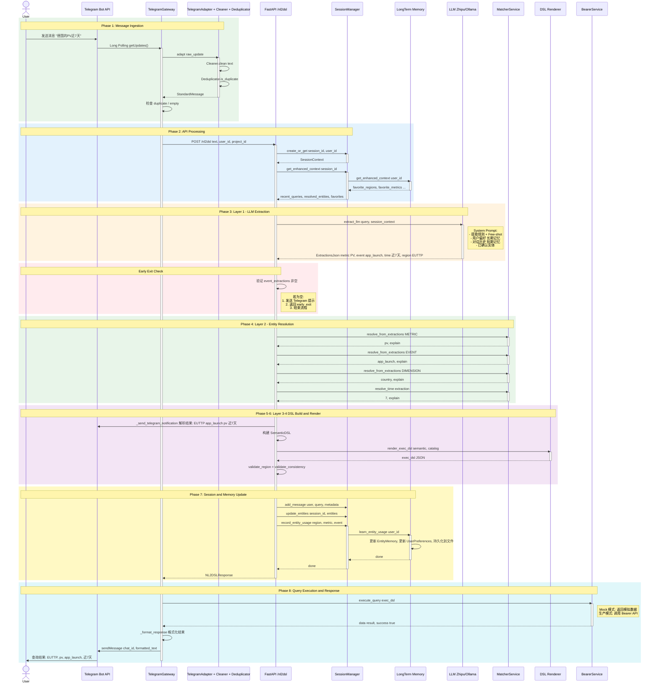

# 运行时序图

[English](sequence.md) | [简体中文](sequence.zh-CN.md)

```mermaid
sequenceDiagram
    actor User
    participant TgAPI as Telegram Bot API
    participant TGGw as TelegramGateway
    participant Ingress as TelegramAdapter + Cleaner + Deduplicator
    participant API as FastAPI /nl2dsl
    participant SessionMgr as SessionManager
    participant LTM as LongTerm Memory
    participant LLM as LLM Zhipu/Ollama
    participant Matcher as MatcherService
    participant Renderer as DSL Renderer
    participant Bearer as BearerService

    rect rgb(232, 245, 233)
    Note over User,Ingress: Phase 1: Message Ingestion
    User->>TgAPI: 发送消息 "德国的PV近7天"
    TgAPI->>TGGw: Long Polling getUpdates()
    activate TGGw
    TGGw->>Ingress: adapt raw_update
    activate Ingress
    Ingress->>Ingress: Cleaner.clean text
    Ingress->>Ingress: Deduplicator.is_duplicate
    Ingress-->>TGGw: StandardMessage
    deactivate Ingress
    TGGw->>TGGw: 检查 duplicate / empty
    end

    rect rgb(227, 242, 253)
    Note over User,SessionMgr: Phase 2: API Processing
    TGGw->>API: POST /nl2dsl text, user_id, project_id
    activate API
    API->>SessionMgr: create_or_get session_id, user_id
    activate SessionMgr
    SessionMgr-->>API: SessionContext
    deactivate SessionMgr
    API->>SessionMgr: get_enhanced_context session_id
    activate SessionMgr
    SessionMgr->>LTM: get_enhanced_context user_id
    activate LTM
    LTM-->>SessionMgr: favorite_regions, favorite_metrics ...
    deactivate LTM
    SessionMgr-->>API: recent_queries, resolved_entities, favorites
    deactivate SessionMgr
    end

    rect rgb(255, 243, 224)
    Note over User,LLM: Phase 3: Layer 1 - LLM Extraction
    API->>LLM: extract_llm query, session_context
    activate LLM
    Note right of LLM: System Prompt:<br/>- 提取规则 + Few-shot<br/>- 用户偏好 长期记忆<br/>- 对话历史 短期记忆<br/>- 已确认实体
    LLM-->>API: ExtractionsJson metric PV, event app_launch, time 近7天, region EUTTP
    deactivate LLM
    end

    rect rgb(255, 235, 238)
    Note over User,API: Early Exit Check
    API->>API: 验证 event_extractions 非空
    Note right of API: 若为空:<br/>1. 发送 Telegram 提示<br/>2. 返回 early_exit<br/>3. 结束流程
    end

    rect rgb(232, 245, 233)
    Note over User,Matcher: Phase 4: Layer 2 - Entity Resolution
    API->>Matcher: resolve_from_extractions METRIC
    activate Matcher
    Matcher-->>API: pv, explain
    deactivate Matcher
    API->>Matcher: resolve_from_extractions EVENT
    activate Matcher
    Matcher-->>API: app_launch, explain
    deactivate Matcher
    API->>Matcher: resolve_from_extractions DIMENSION
    activate Matcher
    Matcher-->>API: country, explain
    deactivate Matcher
    API->>Matcher: resolve_time extraction
    activate Matcher
    Matcher-->>API: 7, explain
    deactivate Matcher
    end

    rect rgb(243, 229, 245)
    Note over User,Renderer: Phase 5-6: Layer 3-4 DSL Build and Render
    API->>TgAPI: _send_telegram_notification 解析结果: EUTTP app_launch pv 近7天
    API->>API: 构建 SemanticDSL
    API->>Renderer: render_exec_dsl semantic, catalog
    activate Renderer
    Renderer-->>API: exec_dsl JSON
    deactivate Renderer
    API->>API: validate_region + validate_consistency
    end

    rect rgb(255, 249, 196)
    Note over User,LTM: Phase 7: Session and Memory Update
    API->>SessionMgr: add_message user, query, metadata
    API->>SessionMgr: update_entities session_id, entities
    API->>SessionMgr: record_entity_usage region, metric, event
    activate SessionMgr
    SessionMgr->>LTM: learn_entity_usage user_id
    activate LTM
    LTM->>LTM: 更新 EntityMemory, 更新 UserPreferences, 持久化到文件
    LTM-->>SessionMgr: done
    deactivate LTM
    SessionMgr-->>API: done
    deactivate SessionMgr
    API-->>TGGw: NL2DSLResponse
    deactivate API
    end

    rect rgb(224, 247, 250)
    Note over User,Bearer: Phase 8: Query Execution and Response
    TGGw->>Bearer: execute_query exec_dsl
    activate Bearer
    Note right of Bearer: Mock 模式: 返回模拟数据<br/>生产模式: 调用 Bearer API
    Bearer-->>TGGw: data result, success true
    deactivate Bearer
    TGGw->>TGGw: _format_response 格式化结果
    TGGw->>TgAPI: sendMessage chat_id, formatted_text
    TgAPI->>User: 查询结果: EUTTP, pv, app_launch, 近7天
    deactivate TGGw
    end
```
